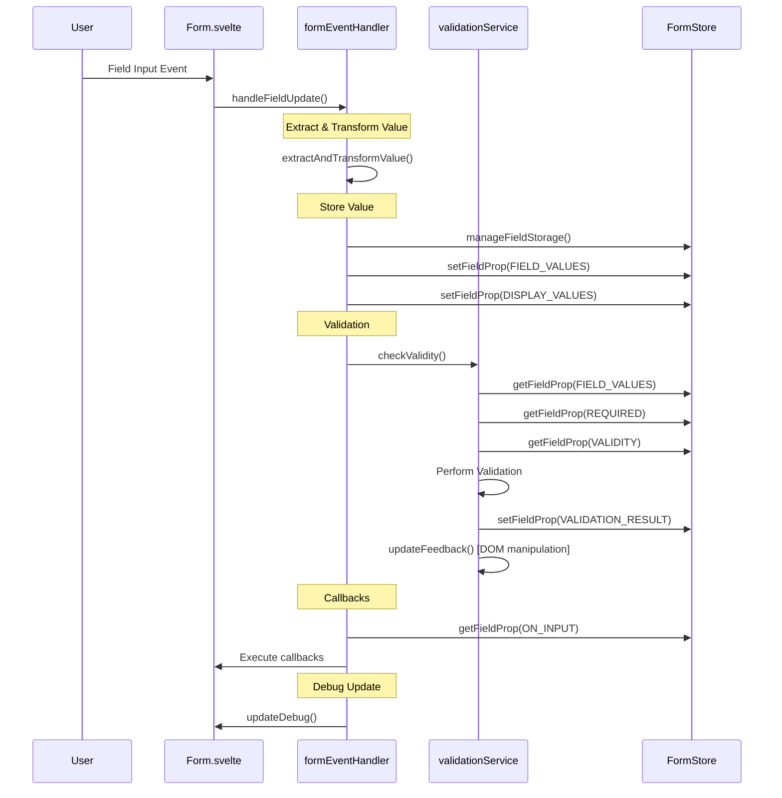
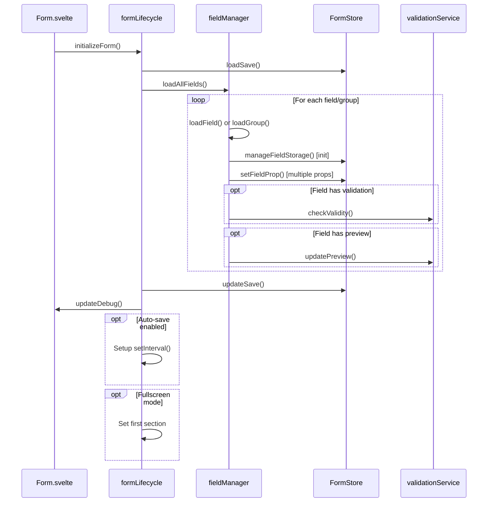

# Form Service Architecture Analysis

## 📊 Current Implementation Dependencies and Flow Diagrams

### 1. Service Dependency Graph (Current Codebase)

```mermaid
graph TD
    %% Core Components
    FormStore["FormStore<br/>Central State Management"]
    FormSvelte["Form.svelte<br/>Main Component"]
    FormRenderer["FormRenderer.svelte<br/>Core Rendering Engine"]
    
    %% Implemented Services
    FormLifecycle["formLifecycle.ts<br/>Form Initialization"]
    FieldManager["fieldManager.ts<br/>Field Operations"]
    FormEventHandler["formEventHandler.ts<br/>Event Processing"]
    ValidationService["validationService.ts<br/>Validation Logic"]
    FormSubmission["formSubmission.ts<br/>Form Submission Handler"]
    
    %% UI Components
    FieldSvelte["Field.svelte<br/>Field Rendering"]
    CheckboxSvelte["Checkbox.svelte<br/>Checkbox Component"]
    DropdownSvelte["Dropdown.svelte<br/>Dropdown Component"]
    ListSvelte["List.svelte<br/>List Component"]
    DividerSvelte["Divider.svelte<br/>Layout Component"]
    
    %% State Management
    CustomStore["CustomStore.ts<br/>UI State Store"]
    DropdownStore["DropdownStore.ts<br/>Dropdown State"]
    
    %% Configuration & Utilities
    Constants["constants.ts<br/>FormProps & Config"]
    FormHelpers["formHelpers.ts<br/>Utility Functions"]
    Kit["kit.ts<br/>Utility Toolkit"]
    
    %% Core Component Dependencies
    FormSvelte --> FormStore
    FormSvelte --> FormLifecycle
    FormSvelte --> FormEventHandler
    FormSvelte --> FormRenderer
    FormSvelte --> FormSubmission
    
    FormRenderer --> FieldSvelte
    FormRenderer --> CustomStore
    
    FieldSvelte --> FormStore
    FieldSvelte --> CustomStore
    FieldSvelte --> CheckboxSvelte
    FieldSvelte --> DropdownSvelte
    FieldSvelte --> DividerSvelte
    FieldSvelte --> ListSvelte
    
    %% Service Dependencies
    FormLifecycle --> FormStore
    FormLifecycle --> FieldManager
    FormLifecycle --> ValidationService
    FormLifecycle --> FormHelpers
    FormLifecycle --> Constants
    
    FieldManager --> FormStore
    FieldManager --> FormHelpers
    FieldManager --> Constants
    
    FormEventHandler --> FormStore
    FormEventHandler --> ValidationService
    FormEventHandler --> Constants
    
    FormSubmission --> FormStore
    FormSubmission --> ValidationService
    FormSubmission --> Kit
    FormSubmission --> Constants
    
    ValidationService --> FormStore
    ValidationService --> CustomStore
    ValidationService --> Constants
    
    %% Specialized Component Dependencies
    DropdownSvelte --> DropdownStore
    DropdownSvelte --> CustomStore
    CheckboxSvelte --> CustomStore
    
    %% Configuration Dependencies
    FormStore --> Kit
    FormStore --> Constants
    
    %% Enhanced styling for better legibility
    classDef core fill:#c8e6c9,stroke:#2e7d32,stroke-width:4px,color:#000,font-weight:bold
    classDef service fill:#bbdefb,stroke:#1565c0,stroke-width:3px,color:#000,font-weight:bold
    classDef ui fill:#ffe0b2,stroke:#ef6c00,stroke-width:3px,color:#000,font-weight:bold
    classDef utility fill:#f1f8e9,stroke:#689f38,stroke-width:3px,color:#000,font-weight:bold
    classDef config fill:#e8eaf6,stroke:#3f51b5,stroke-width:3px,color:#000,font-weight:bold
    
    class FormStore,FormSvelte,FormRenderer core
    class FormLifecycle,FieldManager,FormEventHandler,ValidationService,FormSubmission service
    class FieldSvelte,CheckboxSvelte,DropdownSvelte,ListSvelte,DividerSvelte ui
    class CustomStore,DropdownStore config
    class FormHelpers,Kit,Constants utility
```



#### Current Dependency Explanations (Verified Against Codebase)

##### **Form.svelte → Core Dependencies**

| Connection | Purpose | Necessity | Data Flow |
|------------|---------|-----------|-----------| 
| `Form.svelte → FormStore` | **Reactive state subscription** for UI updates | 🔴 **Critical** | Svelte's `$FormStore` reactive binding for real-time display value updates |
| `Form.svelte → FormLifecycle` | **Form initialization and cleanup** management | 🔴 **Critical** | Form mounting calls `initializeForm()`, unmounting calls `cleanupForm()` |
| `Form.svelte → FormEventHandler` | **User interaction processing** (input, focus, blur) | 🔴 **Critical** | DOM events → Service processing → State updates → UI refresh |
| `Form.svelte → FormRenderer` | **Main rendering delegation** | 🔴 **Critical** | Form.svelte passes props → FormRenderer.svelte handles actual form layout |
| `Form.svelte → formSubmission` | **Form submission handling** | 🔴 **Critical** | Submit button click → formSubmission.ts → validation → callback execution |

##### **FormLifecycle → Dependencies**

| Connection | Purpose | Necessity | Data Flow |
|------------|---------|-----------|-----------| 
| `FormLifecycle → FormStore` | **Initial state population** and persistence management | 🔴 **Critical** | `loadSave()` → `updateSave()` → FormStore property initialization |
| `FormLifecycle → FieldManager` | **Bulk field loading** during form initialization | 🔴 **Critical** | Form config → `loadAllFields()` → Individual field setup |
| `FormLifecycle → ValidationService` | **Initial validation** during form setup | 🟡 **Medium** | Field requirements → Initial validation state |
| `FormLifecycle → FormHelpers` | **Utility functions** for form operations | 🟢 **Low** | Helper functions for form initialization |

##### **FieldManager → Dependencies**

| Connection | Purpose | Necessity | Data Flow |
|------------|---------|-----------|-----------| 
| `FieldManager → FormStore` | **Field data storage** and property management | 🔴 **Critical** | Field config → `manageFieldStorage()` → FormStore population |
| `FieldManager → FormHelpers` | **Utility functions** for field operations | 🟢 **Low** | Helper functions for field type detection and processing |

##### **FormEventHandler → Dependencies**

| Connection | Purpose | Necessity | Data Flow |
|------------|---------|-----------|-----------| 
| `FormEventHandler → FormStore` | **State updates** during event processing | 🔴 **Critical** | Event data → FormStore updates |
| `FormEventHandler → ValidationService` | **Real-time validation** on field changes | 🔴 **Critical** | Field updates → Validation trigger → Result storage |

##### **ValidationService → Dependencies**

| Connection | Purpose | Necessity | Data Flow |
|------------|---------|-----------|-----------| 
| `ValidationService → FormStore` | **Field value access** and validation result storage | 🔴 **Critical** | Field values → Validation logic → Result storage |
| `ValidationService → CustomStore` | **UI configuration** for validation feedback | 🔴 **Critical** | Validation feedback styling and configuration |

##### **FormSubmission → Dependencies**

| Connection | Purpose | Necessity | Data Flow |
|------------|---------|-----------|-----------| 
| `FormSubmission → FormStore` | **Form data collection** and submission state | 🔴 **Critical** | Form fields → Data aggregation → Submission processing |
| `FormSubmission → ValidationService` | **Form-wide validation** before submission | 🔴 **Critical** | Submit trigger → Form validation → Submission approval/rejection |
| `FormSubmission → kit.ts` | **Utility functions** for data processing | 🟡 **Medium** | Data manipulation → Utility functions → Processed submission data |

#### Dependency Criticality Legend
- 🔴 **Critical**: System breaks without this dependency
- 🟡 **Medium**: Performance/functionality degradation without this dependency  
- 🟢 **Low**: Optional enhancement or utility only

### 2. Field Update Flow Diagram (Current Implementation)



### 3. Form Initialization Flow (Current Implementation)



## 🔍 Coupling Analysis (Current Implementation)

### High Coupling Issues

#### 1. FormStore Central Dependency
**Problem**: Every service directly imports and manipulates FormStore
- **Files affected**: All 5 service files
- **Coupling type**: Tight data coupling
- **Risk**: Changes to FormStore structure require updates across all services

```typescript
// Current pattern in EVERY service:
import { setFieldProp, getFieldProp, manageFieldStorage } from '../store/FormStore';
```

#### 2. FormEventHandler Mixed Responsibilities
**Problem**: FormEventHandler handles multiple concerns
- **Dependencies**: FormStore, ValidationService
- **Responsibilities**: Event extraction, value transformation, storage, validation triggering, callback execution
- **Coupling type**: High cohesion within single service
- **Risk**: Changes affect multiple concerns simultaneously

#### 3. ValidationService DOM Manipulation
**Problem**: ValidationService directly manipulates DOM elements
- **Coupling type**: Implementation coupling to browser DOM
- **Risk**: Not testable in isolation, violates separation of concerns

### Medium Coupling Issues

#### 1. Service Communication Patterns
**Problem**: Services communicate through direct imports rather than events
- **Current**: Direct function calls between services
- **Risk**: Tight coupling between service implementations

## 🧩 FormStore Property Usage Patterns (Verified)

### Property Access Frequency Analysis

```javascript
// FormProps usage across current services (verified in codebase)
FIELD_VALUES: Used in formEventHandler, formLifecycle, fieldManager, validationService, formSubmission
DISPLAY_VALUES: Used in formEventHandler, fieldManager
VALIDATION_RESULT: Used in validationService, formSubmission
ACTIVE: Used in formEventHandler, fieldManager
REDACT: Used in formEventHandler, fieldManager
TOUCHED: Used in formEventHandler
REQUIRED: Used in fieldManager, validationService
VALIDITY: Used in fieldManager, validationService
PREVIEW: Used in fieldManager, validationService
ON_INPUT: Used in formEventHandler
GROUP: Used in fieldManager, validationService
SUBMIT: Used in formSubmission
```

### Critical Data Flow Dependencies

#### 1. Field Value Pipeline (Current)
```
User Input → formEventHandler.handleFieldUpdate() → FormStore.manageFieldStorage() → FormStore.fieldValues
         ↓
FormStore.displayValues ← Redaction Logic ← FormStore.getFieldProp(REDACT)
```

#### 2. Validation Pipeline (Current)
```
Field Change → formEventHandler.checkValidity() → validationService.checkValidity()
            ↓
ValidationResult → FormStore.setFieldProp(VALIDATION_RESULT) → validationService.updateFeedback() → DOM
```

## 🚨 Identified Anti-Patterns (Current Implementation)

### 1. God Object Pattern
**Location**: FormStore
- **Issue**: Single store manages all form state across all services
- **Impact**: Tight coupling, difficult testing, no data isolation

### 2. Mixed Concerns Pattern
**Location**: validationService.ts
- **Issue**: Validation logic mixed with DOM manipulation
- **Impact**: Cannot test validation without browser environment

### 3. Service Communication Through Shared State
**Location**: All services communicate via FormStore
- **Issue**: No direct service-to-service communication pattern
- **Impact**: State changes can have unexpected side effects

## 📈 Performance Impact Analysis (Current Implementation)

### Current Performance Characteristics
1. **Multiple FormStore updates**: Each field change triggers 3-4 separate FormStore updates
2. **Synchronous validation**: Validation blocks UI thread
3. **Direct DOM manipulation**: ValidationService manipulates DOM synchronously
4. **No batching**: Each operation updates FormStore individually

### Field Update Performance Issues
1. **Multi-phase update process**: Each phase has overhead
2. **Multiple reactive updates**: Triggers many Svelte reactive statements
3. **Redundant property reads**: Same properties read multiple times
4. **No update batching**: Each field updated individually

## 🔧 Architectural Improvement Opportunities

### 1. Event-Driven Architecture
Replace direct service calls with events:
```typescript
// Instead of direct calls
validationService.checkValidity(...)

// Use events
eventBus.emit('field.changed', { formId, fieldId, value })
```

### 2. Batch Update System
Batch FormStore updates:
```typescript
const batch = new FormStoreBatch(formId);
batch.setFieldValue(fieldId, value);
batch.setDisplayValue(fieldId, displayValue);
batch.execute(); // Single reactive update
```

### 3. Repository Pattern for State
Abstract FormStore access:
```typescript
interface IFieldRepository {
  getValue(formId: string, fieldId: string): Value;
  setValue(formId: string, fieldId: string, value: Value): void;
  getValidation(formId: string, fieldId: string): ValidationResult;
}
```

### 4. Separate UI Concerns
Extract DOM manipulation from validation logic:
```typescript
interface IValidationEngine {
  validate(value: Value, rules: ValidationRules): ValidationResult;
}

interface IUIService {
  updateValidationFeedback(fieldId: string, result: ValidationResult): void;
}
```

## 📋 Refactoring Priority

### High Priority (Critical Issues)
1. **Extract DOM manipulation from ValidationService**: Move to dedicated UI service
2. **Implement update batching**: Reduce reactive update frequency
3. **Add service interfaces**: Enable dependency injection and testing

### Medium Priority (Performance Issues)
1. **Event-driven service communication**: Reduce tight coupling
2. **Add validation caching**: Avoid redundant validation
3. **Implement async validation**: Don't block UI thread

### Low Priority (Code Quality)
1. **Add comprehensive types**: For all service interfaces
2. **Implement proper logging**: Replace console.log calls
3. **Add service lifecycle management**: Proper startup/shutdown

## 🎯 Success Metrics

### Performance Metrics
- Field update time: < 50ms (95th percentile)
- FormStore updates per field change: < 2 (currently 3-4)
- Validation response time: < 20ms
- Memory usage: Stable over time

### Code Quality Metrics
- Cyclomatic complexity: < 10 per function
- Service dependencies: < 3 per service
- Test coverage: > 90%
- Type coverage: 100%

This analysis reflects the current implemented system, which is simpler but has clear architectural debt that impacts maintainability and performance. The core functionality is solid, but the coupling and mixed concerns make it difficult to extend and test effectively.