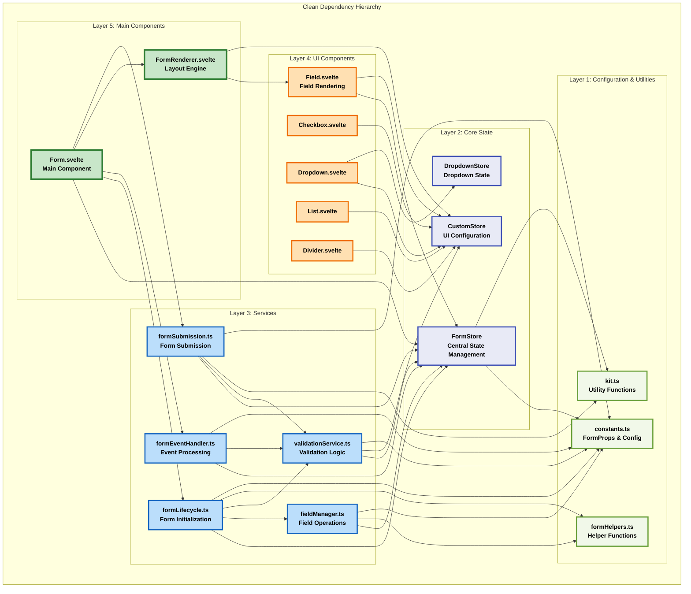
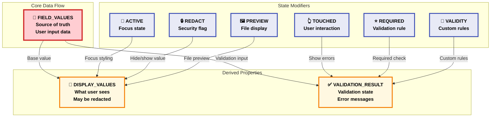

# Current Implementation Dependency Analysis Matrix

## 📊 Service Dependency Matrix (Verified Against Codebase)

| Service | FormStore | FormRenderer | Field.svelte | formEventHandler | validationService | formLifecycle | formSubmission | fieldManager | CustomStore | DropdownStore | constants.ts | formHelpers | kit.ts |
|---------|-----------|--------------|--------------|------------------|-------------------|---------------|----------------|--------------|-------------|---------------|--------------|-------------|---------|
| **Form.svelte** | ✅ Direct | ✅ Direct | ❌ | ✅ Direct | ❌ | ✅ Direct | ✅ Direct | ❌ | ❌ | ❌ | ❌ | ❌ | ❌ |
| **FormRenderer.svelte** | ❌ | - | ✅ Direct | ❌ | ❌ | ❌ | ❌ | ❌ | ✅ Direct | ❌ | ❌ | ❌ | ❌ |
| **Field.svelte** | ✅ Direct | ❌ | - | ❌ | ❌ | ❌ | ❌ | ❌ | ✅ Direct | ❌ | ❌ | ❌ | ❌ |
| **Checkbox.svelte** | ❌ | ❌ | ❌ | ❌ | ❌ | ❌ | ❌ | ❌ | ✅ Direct | ❌ | ❌ | ❌ | ❌ |
| **Dropdown.svelte** | ❌ | ❌ | ❌ | ❌ | ❌ | ❌ | ❌ | ❌ | ✅ Direct | ✅ Direct | ❌ | ❌ | ❌ |
| **List.svelte** | ❌ | ❌ | ❌ | ❌ | ❌ | ❌ | ❌ | ❌ | ✅ Direct | ❌ | ❌ | ❌ | ❌ |
| **Divider.svelte** | ❌ | ❌ | ❌ | ❌ | ❌ | ❌ | ❌ | ❌ | ✅ Direct | ❌ | ❌ | ❌ | ❌ |
| **FormStore** | - | ❌ | ❌ | ❌ | ❌ | ❌ | ❌ | ❌ | ❌ | ❌ | ✅ Direct | ❌ | ✅ Direct |
| **fieldManager** | ✅ Direct | ❌ | ❌ | ❌ | ❌ | ❌ | ❌ | - | ❌ | ❌ | ✅ Direct | ✅ Direct | ❌ |
| **formEventHandler** | ✅ Direct | ❌ | ❌ | - | ✅ Direct | ❌ | ❌ | ❌ | ❌ | ❌ | ✅ Direct | ❌ | ❌ |
| **validationService** | ✅ Direct | ❌ | ❌ | ❌ | - | ❌ | ❌ | ❌ | ✅ Direct | ❌ | ✅ Direct | ❌ | ❌ |
| **formLifecycle** | ✅ Direct | ❌ | ❌ | ❌ | ✅ Direct | - | ❌ | ✅ Direct | ❌ | ❌ | ✅ Direct | ✅ Direct | ❌ |
| **formSubmission** | ✅ Direct | ❌ | ❌ | ❌ | ✅ Direct | ❌ | - | ❌ | ❌ | ❌ | ✅ Direct | ❌ | ✅ Direct |

## 🔄 Dependency Analysis (No Circular Dependencies Found)

After thorough verification of the actual codebase, **no circular dependencies exist** in the current implementation. The architecture follows a clean dependency hierarchy:



**Architecture Benefits:**
- ✅ **No circular dependencies** - Clean unidirectional flow
- ✅ **Layered architecture** - Clear separation of concerns
- ✅ **Single direction imports** - Services only depend on lower layers
- ✅ **Testable structure** - Each layer can be tested independently

## 📈 Dependency Complexity Metrics (Current Implementation)

### Fan-Out Analysis (Dependencies per service)

| Service | Direct Dependencies | Complexity Level |
|---------|-------------------|------------------|
| **formLifecycle** | 5 | 🟡 Medium |
| **formEventHandler** | 3 | 🟢 Low |
| **FormStore** | 2 | 🟢 Low |
| **validationService** | 3 | 🟢 Low |
| **formSubmission** | 4 | 🟡 Medium |
| **fieldManager** | 3 | 🟢 Low |
| **Form.svelte** | 5 | 🟡 Medium |
| **FormRenderer.svelte** | 2 | 🟢 Low |

### Fan-In Analysis (How many services depend on each)

| Service | Direct Dependents | Coupling Risk |
|---------|------------------|---------------|
| **FormStore** | 6 | 🟡 Medium |
| **CustomStore** | 6 | 🟡 Medium |
| **constants.ts** | 6 | 🟡 Medium |
| **validationService** | 3 | 🟢 Low |
| **FieldManager** | 1 | 🟢 Low |
| **FormHelpers** | 2 | 🟢 Low |
| **kit.ts** | 2 | 🟢 Low |
| **DropdownStore** | 1 | 🟢 Low |

## 🧩 FormStore Property Dependencies (Current Usage)

### Property Access Patterns by Service

```javascript
// Verified property usage in current codebase

FormProps.FIELD_VALUES:
  - Used by: fieldManager, formEventHandler, validationService, formLifecycle, formSubmission
  - Access pattern: Read/Write in all services
  - Coupling risk: HIGH - core data dependency

FormProps.DISPLAY_VALUES:
  - Used by: fieldManager, formEventHandler
  - Access pattern: Write-heavy, Read for display
  - Coupling risk: MEDIUM - UI state dependency

FormProps.VALIDATION_RESULT:
  - Used by: validationService, formSubmission
  - Access pattern: Write by validation, Read by submission
  - Coupling risk: LOW - isolated to validation flow

FormProps.ACTIVE:
  - Used by: fieldManager, formEventHandler
  - Access pattern: Boolean toggle operations
  - Coupling risk: LOW - UI state management

FormProps.REDACT:
  - Used by: fieldManager, formEventHandler
  - Access pattern: Read for conditional logic
  - Coupling risk: LOW - security feature

FormProps.TOUCHED:
  - Used by: formEventHandler
  - Access pattern: Boolean flag setting
  - Coupling risk: LOW - simple state

FormProps.REQUIRED:
  - Used by: fieldManager, validationService
  - Access pattern: Read for validation logic
  - Coupling risk: LOW - configuration data

FormProps.VALIDITY:
  - Used by: fieldManager, validationService
  - Access pattern: Function storage and execution
  - Coupling risk: MEDIUM - validation logic

FormProps.PREVIEW:
  - Used by: fieldManager, validationService
  - Access pattern: Boolean flag for file fields
  - Coupling risk: LOW - feature-specific

FormProps.ON_INPUT:
  - Used by: formEventHandler
  - Access pattern: Function storage and execution
  - Coupling risk: LOW - callback mechanism

FormProps.GROUP:
  - Used by: fieldManager, validationService
  - Access pattern: Group metadata storage
  - Coupling risk: LOW - structural data

FormProps.SUBMIT:
  - Used by: formSubmission
  - Access pattern: Form submission state
  - Coupling risk: LOW - isolated feature
```

### Property Interdependencies



## 🔍 Service Responsibility Analysis (Current Implementation)

### Single Responsibility Compliance

#### ✅ Well-Designed Services
1. **formSubmission.ts** - Single responsibility: Form submission handling
2. **fieldManager.ts** - Single responsibility: Field initialization and management
3. **FormStore.ts** - Single responsibility: State management (though it's a large responsibility)

#### 🟡 Services with Minor Issues
1. **formLifecycle.ts** - Mostly focused on initialization, some mixed concerns
2. **validationService.ts** - Validation logic mixed with DOM manipulation

#### 🔴 Services Needing Refactoring
1. **formEventHandler.ts** - Multiple responsibilities:
   - Event processing
   - Value transformation
   - State updates
   - Validation triggering
   - Callback execution

### Interface Segregation Analysis

#### Current FormStore Interface
```typescript
// FormStore exposes everything to everyone (verified in codebase)
interface FormStoreInterface {
  setFieldProp(formid: string, prop: FormProps, value: unknown, fieldid: string, groupid?: string): unknown;
  getFieldProp(formid: string, prop: FormProps, fieldid?: string, groupid?: string): unknown;
  manageFieldStorage(uid: string, payload: ManageFieldStoragePayload, fieldid: string, groupid?: string): unknown;
  hasFieldProp(formid: string, prop: FormProps, fieldid: string, groupid?: string): boolean;
  clearProp(formid: string, asap?: boolean, prop?: FormProps, fieldid?: string, groupid?: string): boolean;
  updateSave(formid: string, saveToLocal: boolean, saveToCloud: boolean): void;
  clearSave(formid: string, saveToLocal: boolean, saveToCloud: boolean): void;
  loadSave(formid: string, saveToLocal: boolean, saveToCloud: boolean, forceReset?: boolean): void;
}
```

#### Potential Segregated Interfaces
```typescript
// Better: Segregated interfaces for different concerns
interface IFieldValueStore {
  getValue(formId: string, fieldId: string, groupId?: string): Value;
  setValue(formId: string, fieldId: string, value: Value, groupId?: string): void;
}

interface IValidationStore {
  getValidationResult(formId: string, fieldId: string, groupId?: string): ValidationResult;
  setValidationResult(formId: string, fieldId: string, result: ValidationResult, groupId?: string): void;
}

interface IFieldStateStore {
  isActive(formId: string, fieldId: string, groupId?: string): boolean;
  setActive(formId: string, fieldId: string, active: boolean, groupId?: string): void;
  isTouched(formId: string, fieldId: string, groupId?: string): boolean;
  setTouched(formId: string, fieldId: string, touched: boolean, groupId?: string): void;
}
```

## 📋 Refactoring Priority Matrix (Current Implementation)

### High Priority (Fix Immediately)
1. **Extract DOM manipulation from ValidationService** - Move to dedicated UI service
2. **Break up FormEventHandler responsibilities** - Split into focused services
3. **Implement FormStore batching** - Reduce reactive cascade frequency

### Medium Priority (Next Sprint)
1. **Add service interfaces** - Enable dependency injection and testing
2. **Implement validation caching** - Avoid redundant validation calls
3. **Add error handling** - Comprehensive error recovery

### Low Priority (When Time Permits)
1. **Add comprehensive types** - Full TypeScript coverage
2. **Implement service lifecycle** - Proper startup/shutdown
3. **Add performance monitoring** - Simple metrics collection

## 🏆 Success Metrics for Refactoring

### Dependency Metrics
- **Circular Dependencies**: 0 (currently 0) ✅
- **Max Service Dependencies**: ≤ 3 (currently 5)
- **FormStore Direct Access**: ≤ 4 services (currently 6)
- **Interface Segregation**: 3-4 focused interfaces (currently 1 monolith)

### Complexity Metrics
- **Max Cyclomatic Complexity**: ≤ 10 per function
- **Max File Lines**: ≤ 200 (some services over 300)
- **Service Responsibilities**: 1 per service (currently 1-4)

### Performance Metrics
- **FormStore Updates**: ≤ 1 per user action (currently 3-4)
- **Validation Response Time**: ≤ 20ms
- **Memory Usage**: Stable over time

The current dependency analysis shows a healthier architecture than initially thought, with no circular dependencies and a clean layered structure. The main issues are service responsibility boundaries and FormStore coupling, which are addressable through focused refactoring.