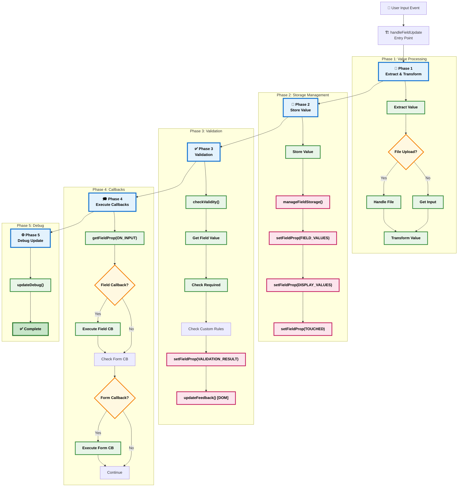
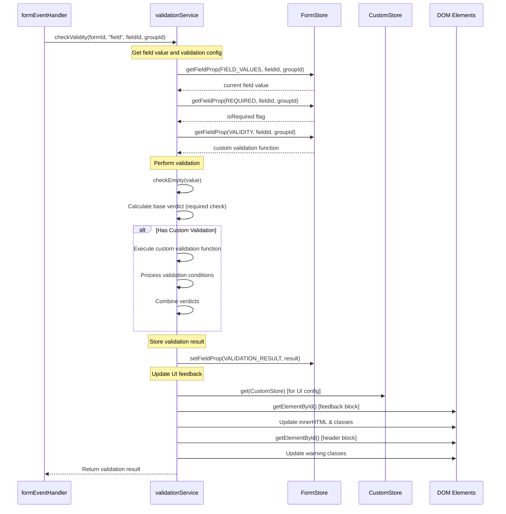
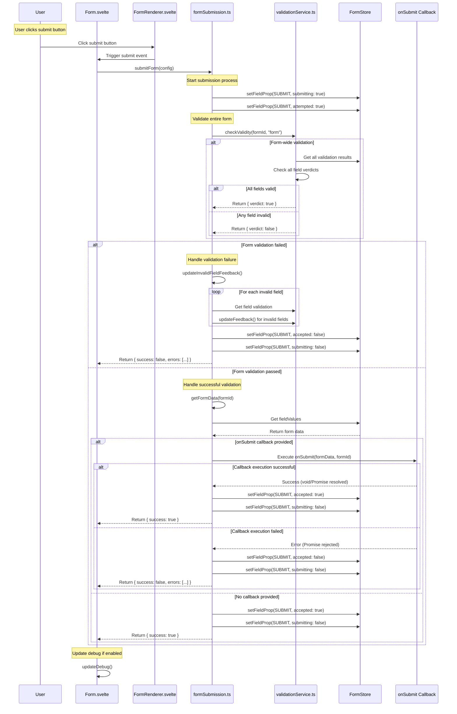
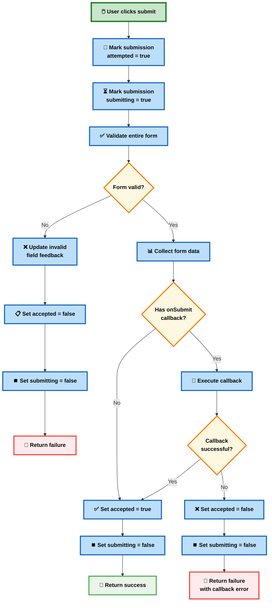
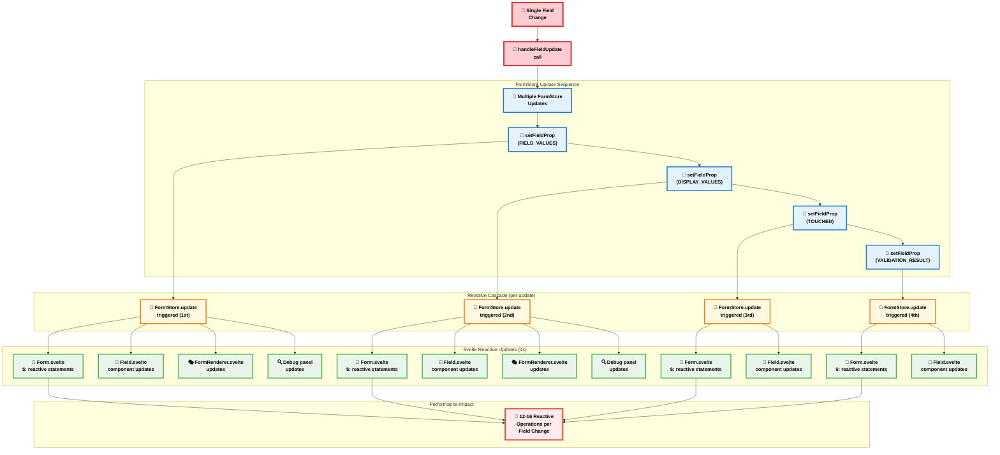

# Current Implementation Flow Diagrams and Complexity Analysis

## 🌊 Field Update Flow Analysis (Current Implementation)

### Field Update Process (Simplified Current Architecture)



### Current Validation Flow 



### Form Initialization Flow (Current Implementation)

```mermaid
sequenceDiagram
    participant FormSvelte as Form.svelte
    participant Lifecycle as formLifecycle
    participant FieldManager as fieldManager
    participant FormStore as FormStore
    participant ValidationService as validationService
    participant FormHelpers as formHelpers
    
    FormSvelte->>Lifecycle: initializeForm()
    
    Note over Lifecycle: Setup form storage
    Lifecycle->>FormStore: loadSave(uid, saveToLocal, saveToCloud, forceReset)
    alt Force Reset or No Existing Store
        FormStore->>FormStore: Initialize empty form structure
        FormStore->>FormStore: Create all property objects
    else Existing Store
        FormStore->>FormStore: Load from localStorage if enabled
        FormStore->>FormStore: Parse JSON and restore fieldValues
    end
    
    Note over Lifecycle: Initialize all fields
    Lifecycle->>FieldManager: loadAllFields(uid, formFields)
    
    loop For each field/group in formFields
        alt Is Group
            FieldManager->>FieldManager: loadGroup(uid, group)
            FieldManager->>FormStore: setFieldProp(GROUP, group.meta)
            
            loop For each field in group
                FieldManager->>FieldManager: loadField(uid, field, group)
                Note over FieldManager: Process individual field in group
            end
        else Is Field
            FieldManager->>FieldManager: loadField(uid, field, undefined)
        end
        
        Note over FieldManager: Field Loading Process
        FieldManager->>FormStore: manageFieldStorage("exists") [check if field exists]
        alt Field Doesn't Exist
            FieldManager->>FormHelpers: loadBlank(field.type) [get default value]
            FieldManager->>FormStore: manageFieldStorage("init") [initialize storage]
            FieldManager->>FormStore: setFieldProp(FIELD_VALUES, defaultValue)
            FieldManager->>FormStore: setFieldProp(DISPLAY_VALUES, defaultValue)
        else Field Exists
            FieldManager->>FormStore: manageFieldStorage("get")
            FieldManager->>FormStore: setFieldProp(FIELD_VALUES, existingValue)
            FieldManager->>FormStore: setFieldProp(DISPLAY_VALUES, existingValue)
        end
        
        Note over FieldManager: Setup field callbacks
        alt Field has onInput
            FieldManager->>FormStore: setFieldProp(ON_INPUT, field.onInput)
        end
        
        Note over FieldManager: Handle redaction
        alt Field is redacted
            FieldManager->>FormStore: setFieldProp(REDACT, redactFlag)
            FieldManager->>FormStore: setFieldProp(DISPLAY_VALUES, "[redacted]")
        end
        
        Note over FieldManager: Initialize field state
        FieldManager->>FormStore: setFieldProp(ACTIVE, false)
        
        Note over FieldManager: Setup validation
        alt Field is required
            FieldManager->>FormStore: setFieldProp(REQUIRED, isRequired)
            FieldManager->>ValidationService: checkValidity(uid, "field", fieldId, groupId)
        end
        
        alt Field has custom validation
            FieldManager->>FormStore: setFieldProp(VALIDITY, field.validity)
            FieldManager->>ValidationService: checkValidity(uid, "field", fieldId, groupId)
        end
        
        Note over FieldManager: Setup file preview
        alt Field is file type and preview enabled
            FieldManager->>FormStore: setFieldProp(PREVIEW, true)
            FieldManager->>FormStore: manageFieldStorage("get") [check for existing files]
            alt Has Files
                FieldManager->>ValidationService: updatePreview(uid, fieldId, groupId)
            end
        end
    end
    
    Note over Lifecycle: Finalize initialization
    Lifecycle->>FormStore: updateSave(uid, saveToLocal, saveToCloud)
    Lifecycle->>FormSvelte: updateDebug()
    
    Note over Lifecycle: Setup auto-save (if enabled)
    alt Auto-save enabled
        Lifecycle->>Lifecycle: setInterval(() => updateSave())
    end
    
    Note over Lifecycle: Setup fullscreen (if enabled)
    alt Fullscreen enabled and has fields
        Lifecycle->>Lifecycle: Set section = formFields[0]
    end
    
    Lifecycle-->>FormSvelte: Return updated state
    
    Note over FormSvelte: Trigger afterFormLoad callback
    alt afterFormLoad provided
        FormSvelte->>FormSvelte: Execute afterFormLoad(refresh)
    end
```



## 📤 Form Submission Flow (Current Implementation)

### Complete Form Submission Process



### Form Submission State Management



## 🔄 Reactive Update Analysis (Current Implementation)

### FormStore Update Propagation



### Performance Impact Analysis (Current Implementation)

```typescript
// Current performance characteristics per field update:

// FormStore updates: 3-4 per field change
//   - Field value storage (FIELD_VALUES)
//   - Display value update (DISPLAY_VALUES)
//   - Touched state (TOUCHED)
//   - Validation result (VALIDATION_RESULT)

// Reactive recalculations: 12-16 per field change
//   - Form.svelte reactive statements (3-4 per update × 4 updates)
//   - Field component updates (2-3 per update × 4 updates) 
//   - FormRenderer updates (1-2 per update × 2-3 updates)
//   - Debug panel updates (1 per update × 4 updates)

// Total impact: 12-16 reactive operations per field keystroke
// With 10 fields actively being edited: 120-160 operations per second
```

## 🎯 Performance Bottlenecks (Current Implementation)

### 1. Multiple FormStore Updates
**Problem**: Every property change triggers separate FormStore update
**Impact**: O(n) performance where n = number of reactive subscribers
**Current**: 3-4 updates per field change
**Solution**: Batch updates into single FormStore operation

### 2. Synchronous Validation
**Problem**: Validation blocks UI thread during execution
**Impact**: UI lag during typing, especially with complex validation
**Current**: Synchronous validation execution
**Solution**: Async validation with debouncing

### 3. DOM Manipulation in Validation
**Problem**: ValidationService queries and updates DOM directly
**Impact**: Layout thrashing and main thread blocking
**Current**: 2-3 DOM queries per validation
**Solution**: Event-driven UI updates with cached element references

### 4. No Auto-Save Implementation
**Problem**: No built-in auto-save mechanism
**Impact**: Risk of data loss, manual save management
**Current**: Manual updateSave() calls only
**Solution**: Implement intelligent auto-save with debouncing

### 5. Reactive Cascade Amplification
**Problem**: Single field change triggers 12-16 reactive operations
**Impact**: UI lag on forms with many fields
**Current**: Uncontrolled cascade propagation
**Solution**: Selective updates with change detection

## 📊 Current Complexity Metrics

### Service Complexity by Lines of Code
- **formEventHandler.ts**: ~330 lines (Very High)
- **validationService.ts**: ~280 lines (High)
- **fieldManager.ts**: ~180 lines (Medium)
- **formLifecycle.ts**: ~150 lines (Medium)
- **formSubmission.ts**: ~120 lines (Low)

### Function Complexity Analysis
- **handleFieldUpdate()**: 25+ decision points (Very High)
- **checkValidity()**: 15+ decision points (High)
- **loadField()**: 12+ decision points (Medium)
- **submitForm()**: 8+ decision points (Medium)

### Performance Characteristics (Estimated)
- **Field update latency**: 20-80ms (varies by form complexity)
- **Memory usage growth**: ~2MB per 100 fields
- **FormStore update frequency**: 3-4 per field change
- **DOM query frequency**: 2-3 per validation

This analysis shows that while the current implementation is functional and has a clean dependency structure, there are clear performance optimization opportunities, particularly around batching FormStore updates and implementing async validation patterns.