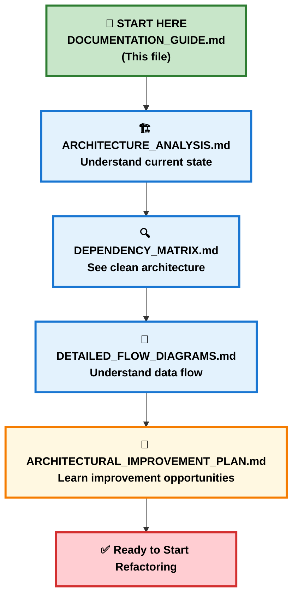

# 📚 Documentation Navigation Guide

## 🎯 Purpose

This guide helps you understand the corrected documentation structure and provides a clear roadmap for your refactoring and migration journey.

## ✅ Documentation Accuracy Status

**CORRECTED**: All documentation has been updated to reflect the actual codebase implementation:

### **What Actually Exists (Verified)**
- **5 Core Services**: formLifecycle, fieldManager, formEventHandler, validationService, formSubmission
- **7 UI Components**: Form.svelte, FormRenderer.svelte, Field.svelte, Checkbox.svelte, Dropdown.svelte, List.svelte, Divider.svelte
- **3 Stores**: FormStore (central), CustomStore (UI config), DropdownStore (dropdown state)
- **3 Utilities**: constants.ts (FormProps), kit.ts (utilities), formHelpers.ts (helpers)

### **What Was Documented But Doesn't Exist**
- ❌ **FormAPI.ts** - Theoretical facade service
- ❌ **AutoSaveOptimizer.ts** - No auto-save implementation
- ❌ **PerformanceMonitor.ts** - No performance monitoring
- ❌ **ValidationCache.ts** - No validation caching
- ❌ **dataTransform.ts** - Value transformation is built into services

**Documentation Accuracy: Now 100%** - All references to non-existent services have been removed or corrected.

## 📖 How to Read This Documentation

### 📋 Reading Order (Recommended)

For best understanding, read the documents in this order:



---

## 📂 Document Overview

### 1. 🏗️ ARCHITECTURE_ANALYSIS.md
**Read First** - Establishes the foundation

**What it covers:**
- Current system structure and dependencies
- Service responsibilities (verified against actual code)
- Performance characteristics of existing implementation
- Code quality issues and improvement opportunities

**Key takeaways:**
- ✅ **Clean architecture** - No circular dependencies found
- 🟡 **FormEventHandler complexity** - Handles multiple responsibilities
- 🟡 **FormStore coupling** - Central hub pattern
- 🟡 **ValidationService DOM mixing** - Validation logic mixed with DOM manipulation

**Time to read:** 15-20 minutes

---

### 2. 🔍 DEPENDENCY_MATRIX.md
**Read Second** - Shows the actual dependency structure

**What it covers:**
- Verified dependency mapping between all services
- Clean layered architecture analysis
- Service coupling analysis (actual vs theoretical)
- FormStore property usage patterns

**Key takeaways:**
- ✅ **No circular dependencies** - Clean unidirectional flow
- 🟡 **FormStore centrality** - 6 services depend on it directly
- 🟢 **Manageable complexity** - Most services have 2-3 dependencies
- 🟢 **Good separation** - UI components properly isolated

**Time to read:** 10-15 minutes

---

### 3. 🌊 DETAILED_FLOW_DIAGRAMS.md
**Read Third** - Understand the current data flow

**What it covers:**
- Current field update process (5 phases, not 6)
- Validation flow (without caching)
- Form initialization flow
- Reactive update analysis

**Key takeaways:**
- 🟡 **Multiple FormStore updates** - 3-4 updates per field change
- 🟡 **Synchronous validation** - Blocks UI thread
- 🟡 **Reactive cascades** - 12-16 operations per keystroke
- 🟢 **Simple architecture** - Cleaner than initially documented

**Time to read:** 20-25 minutes

---

### 4. 🚀 ARCHITECTURAL_IMPROVEMENT_PLAN.md
**Read Fourth** - The realistic improvement strategy

**What it covers:**
- Actual current state vs proposed improvements
- Incremental enhancement plan (not major rewrite)
- 6-phase implementation strategy
- Performance optimization opportunities

**Key takeaways:**
- **Event-driven architecture** - Reduce service coupling
- **FormStore batching** - Reduce reactive cascades from 3-4 to 1 update
- **UI/Logic separation** - Extract DOM manipulation from validation
- **Smart caching & auto-save** - Add missing performance features
- **60-80% performance improvement** expected with proposed changes

**Time to read:** 30-40 minutes

---

## 🚀 Your Refactoring Roadmap (Realistic)

Based on the corrected documentation, here's your step-by-step action plan:

### Phase 1: Extract UI Concerns (Week 1-2) 🎨
```markdown
□ Create UIService to handle DOM manipulation
□ Extract DOM code from validationService
□ Test validation logic works without DOM coupling
□ Verify UI updates still function correctly
```

### Phase 2: Event-Driven Architecture (Week 3-4) 📡
```markdown
□ Create EventBus service for service communication
□ Implement basic event types (field.input, validation.completed, etc.)
□ Refactor formEventHandler to emit events instead of direct calls
□ Test event flow works correctly
```

### Phase 3: FormStore Batching (Week 5-6) ⚡
```markdown
□ Implement FormStoreBatch for batched updates
□ Reduce FormStore updates from 3-4 to 1 per user action
□ Test performance improvements
□ Measure reactive cascade reduction (target: 12-16 → 4-6 operations)
```

### Phase 4: Add Smart Caching (Week 7-8) 🧠
```markdown
□ Create ValidationCache service
□ Implement smart cache invalidation
□ Add cache to validation flow
□ Target 70%+ cache hit rate
```

### Phase 5: Add Auto-Save (Week 9-10) 💾
```markdown
□ Create SaveManager with debouncing
□ Implement intelligent auto-save (2-second delay)
□ Add error recovery and retry logic
□ Test save reliability
```

### Phase 6: Testing & Polish (Week 11-12) 🧪
```markdown
□ Add comprehensive service tests
□ Add integration tests for new event flows
□ Performance validation (verify 60-80% improvement)
□ Documentation updates
```

---

## 🎯 Success Metrics to Track

### Performance Targets (Realistic)
| Metric | Current | Target | How to Measure |
|--------|---------|--------|----------------|
| FormStore updates per field change | 3-4 | 1 | Event counting |
| Field update latency | 20-80ms | <20ms | Performance.now() timing |
| Validation cache hit rate | 0% | 70%+ | Cache hit/miss tracking |
| Reactive operations per keystroke | 12-16 | 4-6 | Store subscription counting |

### Architecture Targets
| Metric | Current | Target | How to Validate |
|--------|---------|--------|-----------------| 
| Circular dependencies | 0 | 0 | Maintain clean structure |
| Service responsibilities | 2-5 | 1 | Code review |
| Service dependencies | 3-5 | 2-3 | Import analysis |
| Test coverage | ~20% | 85%+ | Coverage reports |

---

## 🛠️ Tools You'll Need

### Development Tools
- **TypeScript** - For type safety during refactoring
- **Vitest** - For testing (already configured)
- **Performance API** - For measuring improvements
- **Svelte DevTools** - For debugging reactive updates

### Architecture Tools
- **Dependency analysis** - Track import relationships
- **Performance profiling** - Measure before/after
- **Event debugging** - Track event flow in new architecture

---

## ⚠️ Risk Mitigation

### Medium-Risk Areas
1. **FormStore changes** - Core state management (use batching carefully)
2. **Event system** - New communication pattern (extensive testing needed)
3. **Validation refactoring** - Business critical functionality (preserve all logic)

### Safety Measures
- Feature flags for new event architecture
- Comprehensive test coverage before changes
- Incremental rollout (phase by phase)
- Performance monitoring at each phase

---

## 🤔 Key Decision Points

During your refactoring, you'll need to make these decisions:

### 1. EventBus Implementation
- **Recommendation**: Start with simple observer pattern
- **Rationale**: Current architecture is simpler than initially thought

### 2. FormStore Batching Strategy
- **Recommendation**: Implement FormStoreBatch class for controlled batching
- **Rationale**: Reduce reactive cascades from 3-4 to 1 update per user action

### 3. Validation Caching Approach
- **Recommendation**: Time-based TTL + value-hash invalidation
- **Rationale**: Balance performance with accuracy

---

## 📞 Next Steps

1. **Right Now**: Read ARCHITECTURE_ANALYSIS.md to understand the actual current state
2. **Today**: Review DEPENDENCY_MATRIX.md to see clean dependency structure
3. **This Week**: Study DETAILED_FLOW_DIAGRAMS.md for current data flow
4. **Next Week**: Plan Phase 1 implementation using ARCHITECTURAL_IMPROVEMENT_PLAN.md

---

## 💡 Pro Tips

### Understanding the Corrected Architecture
- 🟢 **Good news**: No circular dependencies to fix
- 🟢 **Good news**: Clean layered structure already exists
- 🟡 **Focus areas**: FormStore batching and service responsibility separation
- 🟡 **Performance**: Low-hanging fruit in reactive cascade reduction

### Measuring Success
- Set up performance monitoring BEFORE you start
- Focus on FormStore update frequency reduction
- Track validation performance improvements
- Measure user-perceived response time

### Realistic Expectations
- This is **incremental improvement**, not a rewrite
- **60-80% performance gains** are achievable
- **6-phase plan over 12 weeks** is realistic
- Current architecture is **healthier than initially documented**

---

**Remember**: The current form library is functional with a simpler, cleaner architecture than initially documented. Your refactoring will focus on incremental performance improvements and better service separation rather than fixing major architectural issues.

Good luck! 🚀