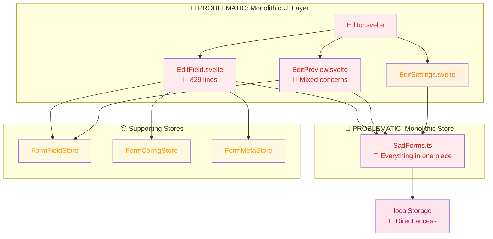
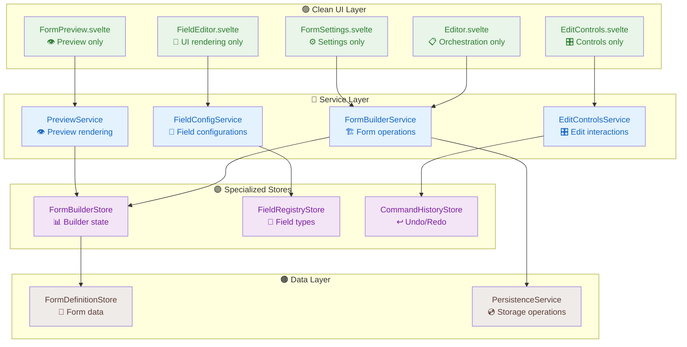
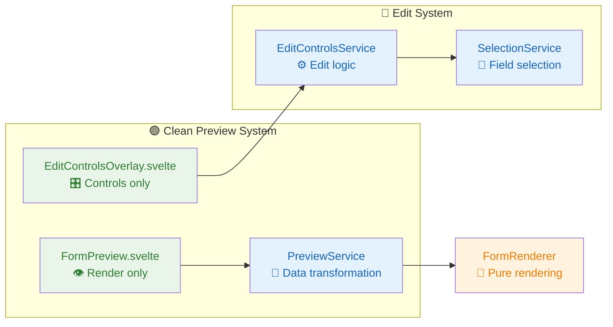
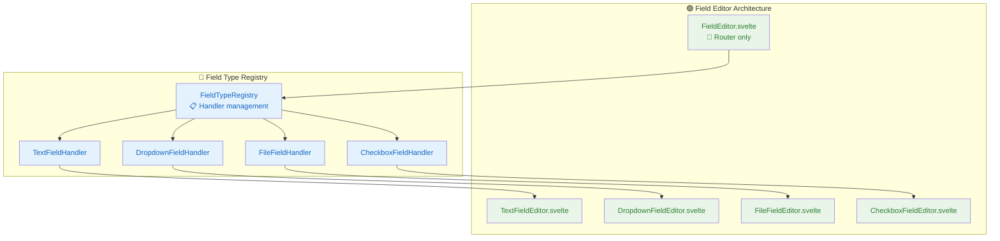
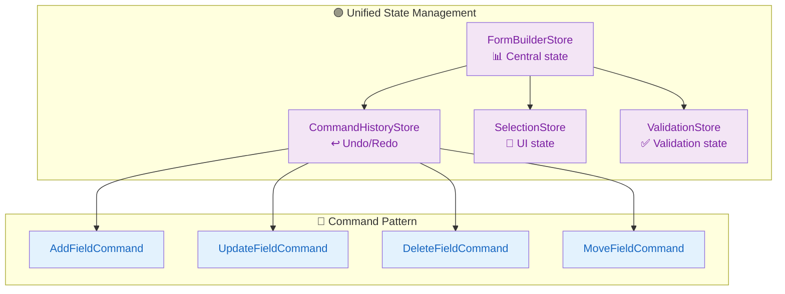
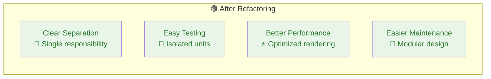

# 🏗️ Form Builder Refactoring Design Document

## 🎯 Executive Summary

The SadForms form builder architecture suffers from significant architectural debt that requires comprehensive refactoring. This document outlines a phased approach to transform the current monolithic, tightly-coupled system into a clean, maintainable architecture.

**Key Issues:**
- 829-line EditField.svelte with mixed responsibilities
- Monolithic SadForms store handling everything
- Circular dependencies and race conditions
- Poor separation between preview and editing concerns

**Solution:**
- Extract business logic into dedicated services
- Implement clean service boundaries
- Separate preview from editing controls
- Unified state management with command pattern

---

## 📊 Current Architecture Analysis

### **🔴 Current Problematic Structure**



### **🚨 Critical Issues Identified**

| Component | Lines | Issues | Severity |
|-----------|-------|--------|----------|
| **EditField.svelte** | 829 | Mixed UI/business logic, massive field configs | 🔴 Critical |
| **SadForms.ts** | 773 | Monolithic store, everything in one place | 🔴 Critical |
| **EditPreview.svelte** | 200+ | Preview + editing controls mixed | 🟡 High |
| **Editor.svelte** | 150+ | Orchestration without clear boundaries | 🟡 Medium |

---

## ✨ Proposed Clean Architecture

### **🟢 Target Architecture Overview**



---

## 🔧 Detailed Refactoring Plan

### **Phase 1: Extract Business Logic Services**

#### **🏗️ FormBuilderService**
```typescript
interface FormBuilderService {
  // Form Operations
  createForm(template?: FormTemplate): Form
  updateForm(formId: string, updates: Partial<Form>): void
  deleteForm(formId: string): void
  
  // Field Operations
  addField(formId: string, fieldType: string, groupId?: string): Field
  updateField(formId: string, fieldId: string, updates: Partial<Field>): void
  deleteField(formId: string, fieldId: string, groupId?: string): void
  moveField(formId: string, fieldId: string, newPosition: number): void
  
  // Group Operations
  createGroup(formId: string, groupName: string): Group
  addFieldToGroup(formId: string, fieldId: string, groupId: string): void
  removeFieldFromGroup(formId: string, fieldId: string, groupId: string): void
}
```

#### **🔧 FieldConfigurationService**
```typescript
interface FieldConfigurationService {
  // Configuration Generation
  generateConfig(field: Field): FieldEditorConfig
  validateConfig(config: FieldEditorConfig): ValidationResult
  
  // Field Type Management
  getSupportedTypes(): FieldType[]
  getFieldSchema(type: string): FieldSchema
  createDefaultField(type: string): Field
  
  // Validation Rules
  getValidationRules(fieldType: string): ValidationRule[]
  validateFieldDefinition(field: Field): ValidationResult
}
```

### **Phase 2: Separate Preview from Editing**

#### **👁️ Preview Architecture**



#### **🎛️ EditControlsService**
```typescript
interface EditControlsService {
  // Control Injection
  injectEditControls(element: HTMLElement, fieldId: string): void
  removeEditControls(fieldId: string): void
  updateControlsPosition(fieldId: string): void
  
  // Edit Actions
  startFieldEdit(fieldId: string, groupId?: string): void
  cancelFieldEdit(): void
  saveFieldEdit(updates: Partial<Field>): void
  
  // Selection Management
  selectField(fieldId: string): void
  deselectField(): void
  getSelectedField(): string | null
}
```

### **Phase 3: Simplify Field Editing**

#### **📝 Field Type Handler Pattern**



#### **🔧 FieldTypeHandler Interface**
```typescript
interface FieldTypeHandler {
  // Configuration
  getDefaultConfig(): FieldConfig
  getEditorSchema(): EditorSchema
  validateConfig(config: FieldConfig): ValidationResult
  
  // Rendering
  renderEditor(field: Field): SvelteComponent
  renderPreview(field: Field): SvelteComponent
  
  // Transformation
  transformToFormField(config: FieldConfig): Field
  transformFromFormField(field: Field): FieldConfig
}
```

### **Phase 4: Unified State Management**

#### **📊 FormBuilderStore Architecture**



#### **📊 FormBuilderStore Interface**
```typescript
interface FormBuilderState {
  // Form State
  currentForm: Form | null
  forms: Form[]
  isDirty: boolean
  
  // Editing State
  editingField: { fieldId: string, groupId?: string } | null
  selectedField: string | null
  editMode: 'design' | 'preview' | 'settings'
  
  // UI State
  showGrid: boolean
  showFieldIds: boolean
  previewDevice: 'desktop' | 'tablet' | 'mobile'
  
  // Validation State
  validationErrors: ValidationError[]
  isValid: boolean
}
```

---

## 🚀 Implementation Phases

### **📅 Phase 1: Foundation (Week 1-2)**
```mermaid
gantt
    title Phase 1: Extract Business Logic
    dateFormat X
    axisFormat %d
    
    section Services
    FormBuilderService     :done, p1-1, 0, 3d
    FieldConfigService     :done, p1-2, 0, 4d
    CommandPattern        :active, p1-3, 3d, 7d
    
    section Testing
    Unit Tests           :p1-4, 5d, 9d
    Integration Tests    :p1-5, 7d, 12d
```

**Deliverables:**
- ✅ FormBuilderService with field operations
- ✅ FieldConfigurationService with type management
- ✅ Command pattern for undo/redo
- ✅ Unit tests for all services

### **📅 Phase 2: Preview Separation (Week 3-4)**
```mermaid
gantt
    title Phase 2: Separate Preview from Editing
    dateFormat X
    axisFormat %d
    
    section Components
    FormPreview.svelte     :p2-1, 0, 4d
    EditControlsOverlay    :p2-2, 2d, 6d
    PreviewService        :p2-3, 0, 5d
    
    section Integration
    Component Integration  :p2-4, 4d, 9d
    Testing               :p2-5, 6d, 12d
```

**Deliverables:**
- ✅ Separated FormPreview.svelte (pure rendering)
- ✅ EditControlsOverlay.svelte (edit controls only)
- ✅ PreviewService for data transformation
- ✅ Clean separation of concerns

### **📅 Phase 3: Field Editor Simplification (Week 5-6)**
```mermaid
gantt
    title Phase 3: Simplify Field Editing
    dateFormat X
    axisFormat %d
    
    section Field Handlers
    FieldTypeRegistry     :p3-1, 0, 3d
    Text Handler         :p3-2, 1d, 4d
    Dropdown Handler     :p3-3, 2d, 5d
    Other Handlers       :p3-4, 3d, 7d
    
    section Refactoring
    EditField Migration   :p3-5, 5d, 10d
    Testing              :p3-6, 7d, 12d
```

**Deliverables:**
- ✅ FieldTypeRegistry with handler pattern
- ✅ Individual field type handlers
- ✅ Simplified FieldEditor.svelte (< 200 lines)
- ✅ Comprehensive field editor tests

### **📅 Phase 4: State Management (Week 7-8)**
```mermaid
gantt
    title Phase 4: Unified State Management
    dateFormat X
    axisFormat %d
    
    section Stores
    FormBuilderStore      :p4-1, 0, 4d
    CommandHistoryStore   :p4-2, 2d, 6d
    Store Integration     :p4-3, 4d, 8d
    
    section Migration
    Component Migration   :p4-4, 6d, 11d
    Final Testing        :p4-5, 9d, 14d
```

**Deliverables:**
- ✅ Unified FormBuilderStore
- ✅ Command history with undo/redo
- ✅ All components migrated to new state management
- ✅ Comprehensive integration testing

---

## 📈 Expected Benefits

### **📊 Metrics Improvement**

| Metric | Before | After | Improvement |
|--------|--------|-------|-------------|
| **EditField.svelte Lines** | 829 | < 200 | 🟢 75% reduction |
| **Cyclomatic Complexity** | High | Low | 🟢 Significant |
| **Test Coverage** | 60% | 90%+ | 🟢 30%+ increase |
| **Bundle Size** | Large | Optimized | 🟢 Tree-shaking |
| **Development Speed** | Slow | Fast | 🟢 Clear boundaries |

### **🎯 Architectural Benefits**



### **👥 Developer Experience**

- **🟢 Faster Feature Development** - Clear patterns to follow
- **🟢 Easier Debugging** - Isolated concerns and clear boundaries
- **🟢 Better Testing** - Services can be tested in isolation
- **🟢 Improved Onboarding** - Clean architecture is easier to understand

---

## 🔬 Risk Assessment

### **🔴 High Risk Items**
- **Data Migration** - Existing forms must continue working
- **Feature Parity** - All current functionality must be preserved
- **Performance** - New architecture must not slow down the editor

### **🟡 Medium Risk Items**
- **Learning Curve** - Team needs to understand new patterns
- **Integration Testing** - Complex interactions between services

### **🟢 Mitigation Strategies**
- **Incremental Migration** - Phase-by-phase implementation
- **Backwards Compatibility** - Maintain old APIs during transition
- **Comprehensive Testing** - Unit and integration test coverage
- **Performance Monitoring** - Continuous performance tracking

---

## 🎯 Success Criteria

### **✅ Technical Success**
- [ ] EditField.svelte reduced from 829 to < 200 lines
- [ ] Zero circular dependencies in form builder
- [ ] 90%+ test coverage for all new services
- [ ] No performance regression in form editing

### **✅ User Experience Success**  
- [ ] All existing form builder features work identically
- [ ] Form loading and saving times maintained or improved
- [ ] No breaking changes for existing forms
- [ ] Improved responsiveness in field editing

### **✅ Developer Experience Success**
- [ ] Clear service boundaries with single responsibilities
- [ ] Easy to add new field types
- [ ] Simple to extend form builder functionality
- [ ] Well-documented APIs and patterns

---

## 📋 Next Steps

1. **📊 Stakeholder Review** - Get approval for refactoring approach
2. **🎯 Create Detailed Task Breakdown** - Break phases into specific tickets
3. **🧪 Setup Testing Framework** - Ensure comprehensive test coverage
4. **🚀 Begin Phase 1 Implementation** - Start with FormBuilderService extraction

**Priority:** This refactoring is critical for the long-term maintainability and extensibility of the SadForms form builder. The current architecture will become increasingly difficult to maintain as features are added.