# 🏗️ Form Builder Refactoring Design Document

## 🎯 Executive Summary

The SadForms form builder architecture suffers from significant architectural debt that requires comprehensive refactoring. This document outlines a **dogfooding-first approach** to transform the current monolithic system into a clean, self-referential architecture that uses SadForms components to build SadForms.

**Key Issues:**
- 829-line EditField.svelte with mixed responsibilities **but already dogfooding**
- Monolithic SadForms store handling everything
- Circular dependencies and race conditions
- Poor separation between preview and editing concerns
- **Inconsistent dogfooding**: Some components dogfood well, others don't

**Dogfooding-Improvement Solution:**
- **🐕 Better SadForms dogfooding**: Clean up existing form component usage
- **Meta-circular architecture**: Extract embedded form definitions into reusable configs
- **Consistent self-validation**: Standardize builder's use of own validation system
- Extract business logic from monolithic components
- Leverage existing form stores and event handlers more consistently
- Unified state management using proven form patterns

---

## 📊 Current Architecture Analysis

### **🔴 Current Problematic Structure**

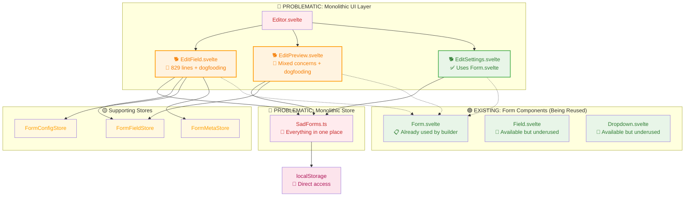

**🐕 Current Dogfooding Status:**
- **🟢 Green**: EditSettings.svelte properly dogfoods Form.svelte
- **🟠 Orange**: EditField.svelte & EditPreview.svelte dogfood but with architectural issues
- **🔴 Red**: Editor.svelte and SadForms.ts don't use form components

### **🚨 Critical Issues Identified**

| Component | Lines | Issues | Dogfooding Status | Severity |
|-----------|-------|--------|-------------------|----------|
| **EditField.svelte** | 829 | Mixed UI/business logic, massive field configs | 🟠 Uses Form.svelte but buried | 🔴 Critical |
| **SadForms.ts** | 773 | Monolithic store, everything in one place | 🔴 No form components | 🔴 Critical |
| **EditPreview.svelte** | 200+ | Preview + editing controls mixed | 🟠 Uses Form.svelte | 🟡 High |
| **EditSettings.svelte** | 150+ | Well-structured, good separation | 🟢 Clean Form.svelte usage | 🟢 Good |
| **Editor.svelte** | 150+ | Orchestration without clear boundaries | 🔴 No form components | 🟡 Medium |

---

## 🐕 Dogfooding Architecture Analysis

### **🎯 Available SadForms Components for Reuse**

The existing SadForms component library provides everything needed to build the form builder interface:

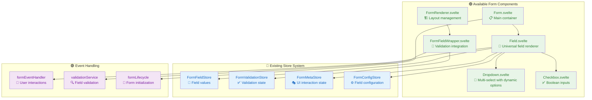

### **🔄 Meta-Circular Design Pattern**

The form builder will use SadForms to define itself:

```typescript
// Form Builder Configuration Form
const FORM_BUILDER_CONFIG: Form = {
  uid: "form-builder-config",
  title: "Form Builder Configuration",
  fields: {
    formName: {
      uid: "formName",
      name: "Form Name",
      type: "text",
      required: true,
      placeholder: "Enter form name..."
    },
    formDescription: {
      uid: "formDescription", 
      name: "Description",
      type: "textarea",
      placeholder: "Describe your form..."
    },
    saveToLocal: {
      uid: "saveToLocal",
      name: "Save to Local Storage",
      type: "checkbox",
      defaultValue: true
    }
  }
}

// Field Configuration Form (used to configure each field)
const FIELD_CONFIG_FORM: Form = {
  uid: "field-config",
  title: "Field Configuration", 
  fields: {
    fieldName: {
      uid: "fieldName",
      name: "Field Label", 
      type: "text",
      required: true
    },
    fieldType: {
      uid: "fieldType",
      name: "Field Type",
      type: "dropdown",
      options: [
        {uid: "text", name: "Text Input"},
        {uid: "textarea", name: "Text Area"},
        {uid: "dropdown", name: "Dropdown"},
        {uid: "checkbox", name: "Checkbox"},
        {uid: "email", name: "Email"}
      ],
      required: true
    },
    required: {
      uid: "required",
      name: "Required Field",
      type: "checkbox",
      defaultValue: false
    }
  }
}
```

### **🎭 Self-Validating System**

The builder validates itself using its own validation system:

```typescript
// Validation for form builder inputs
const BUILDER_VALIDATION = {
  formName: (value: string) => ({
    notEmpty: {
      check: value && value.trim().length > 0,
      true: "Form name is valid",
      false: "Form name is required"
    },
    validLength: {
      check: value && value.length <= 50,
      true: "Length is appropriate", 
      false: "Form name too long (max 50 characters)"
    }
  }),
  
  fieldType: (value: string) => ({
    validType: {
      check: SUPPORTED_FIELD_TYPES.includes(value),
      true: "Valid field type selected",
      false: "Please select a valid field type"
    }
  })
}
```

---

## ✨ Proposed Clean Architecture

### **🟢 Target Architecture Overview**

```mermaid
graph TD
    subgraph "🟢 Clean UI Layer"
        A["🐕 Editor.svelte<br/>📋 Uses Form.svelte"]
        B["🐕 FieldEditor.svelte<br/>🎯 Uses Field.svelte"]
        C["🐕 FormPreview.svelte<br/>👁️ Uses Form.svelte"]
        D["🐕 EditControls.svelte<br/>🎛️ Uses form components"]
        E["🐕 FormSettings.svelte<br/>⚙️ Uses GroupWrapper.svelte"]
    end
    
    subgraph "🔵 Service Layer"
        F[FormBuilderService<br/>🏗️ Form operations]
        G["🐕 FieldConfigService<br/>🔧 Form-based configs"]
        H["🐕 PreviewService<br/>👁️ Form transformation"]
        I[EditControlsService<br/>🎛️ Edit interactions]
    end
    
    subgraph "🟣 Specialized Stores"
        J["🐕 FormBuilderStore<br/>📊 Uses FormFieldStore"]
        K["🐕 FieldRegistryStore<br/>📝 Form definitions"]
        L["🐕 CommandHistoryStore<br/>↩️ Form-based undo/redo"]
    end
    
    subgraph "🟤 Data Layer"
        M["🐕 FormDefinitionStore<br/>💾 Self-referential data"]
        N[PersistenceService<br/>💿 Storage operations]
    end
    
    subgraph "🐕 Dogfooding Components"
        O[Form.svelte<br/>📋 Universal renderer]
        P[Field.svelte<br/>🎯 Universal field]
        Q[Dropdown.svelte<br/>📝 Builder controls]
        R[GroupWrapper.svelte<br/>📦 Settings panels]
    end
    
    A --> F
    B --> G
    C --> H
    D --> I
    E --> F
    
    F --> J
    G --> K
    H --> J
    I --> L
    
    J --> M
    F --> N
    
    A -.-> O
    B -.-> P
    C -.-> O
    D -.-> Q
    E -.-> R
    
    style A fill:#fff3e0,color:#f57c00,stroke:#ff9800,stroke-width:3px
    style B fill:#fff3e0,color:#f57c00,stroke:#ff9800,stroke-width:3px
    style C fill:#fff3e0,color:#f57c00,stroke:#ff9800,stroke-width:3px
    style D fill:#fff3e0,color:#f57c00,stroke:#ff9800,stroke-width:3px
    style E fill:#fff3e0,color:#f57c00,stroke:#ff9800,stroke-width:3px
    style F fill:#e3f2fd,color:#1565c0
    style G fill:#fff3e0,color:#f57c00,stroke:#ff9800,stroke-width:3px
    style H fill:#fff3e0,color:#f57c00,stroke:#ff9800,stroke-width:3px
    style I fill:#e3f2fd,color:#1565c0
    style J fill:#fff3e0,color:#f57c00,stroke:#ff9800,stroke-width:3px
    style K fill:#fff3e0,color:#f57c00,stroke:#ff9800,stroke-width:3px
    style L fill:#fff3e0,color:#f57c00,stroke:#ff9800,stroke-width:3px
    style M fill:#fff3e0,color:#f57c00,stroke:#ff9800,stroke-width:3px
    style N fill:#efebe9,color:#5d4037
    style O fill:#4caf50,color:#ffffff,stroke:#2e7d32,stroke-width:4px
    style P fill:#4caf50,color:#ffffff,stroke:#2e7d32,stroke-width:4px
    style Q fill:#4caf50,color:#ffffff,stroke:#2e7d32,stroke-width:4px
    style R fill:#4caf50,color:#ffffff,stroke:#2e7d32,stroke-width:4px
```

**🐕 Dogfooding Legend:**
- **🟠 Orange Border**: Components redesigned to use SadForms components
- **🟢 Green Fill**: Existing SadForms components reused by builder
- **🔵 Blue Fill**: Services that remain largely unchanged
- **🟤 Brown Fill**: Non-dogfooded infrastructure components

---

## 🔄 Current vs Target Architecture Comparison

### **📊 What's Actually Changing**

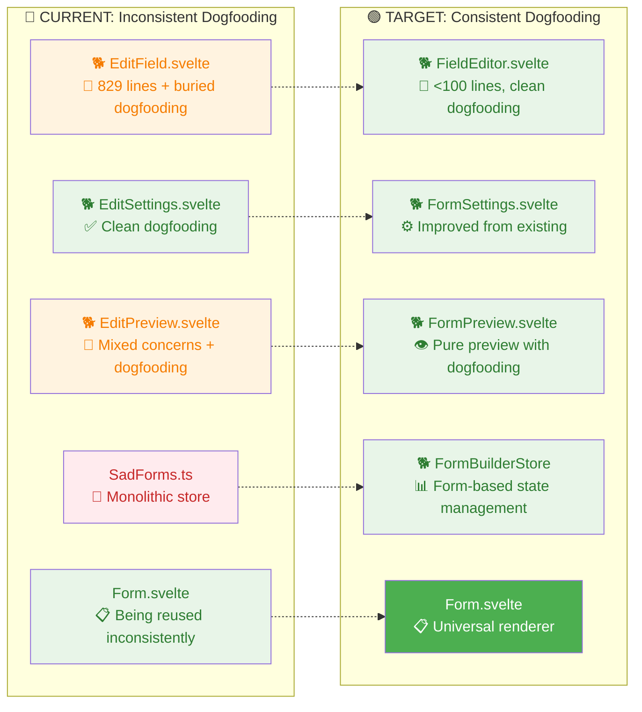

### **🎯 Transformation Summary**

| Component | Current State | Target State | Change Type |
|-----------|--------------|--------------|-------------|
| **EditField.svelte** | 🟠 Dogfoods but 829 lines | 🟢 Clean <100 line router | **🔥 Major Refactor** |
| **EditSettings.svelte** | 🟢 Already good dogfooding | 🟢 Minor improvements | **✨ Enhancement** |
| **EditPreview.svelte** | 🟠 Mixed concerns + dogfooding | 🟢 Pure preview dogfooding | **🔧 Separation** |
| **SadForms.ts** | 🔴 No form components | 🟢 Form-based state | **🔄 Complete Redesign** |
| **Editor.svelte** | 🔴 No form components | 🟢 Form-based orchestration | **🔄 Complete Redesign** |

### **📈 Key Architectural Improvements**

#### **🔥 From Buried to Clean Dogfooding**
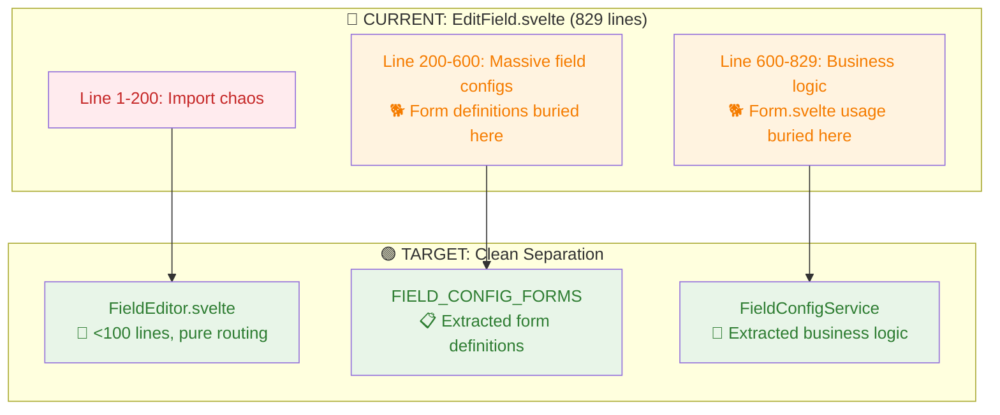

#### **✨ From Inconsistent to Universal Dogfooding**
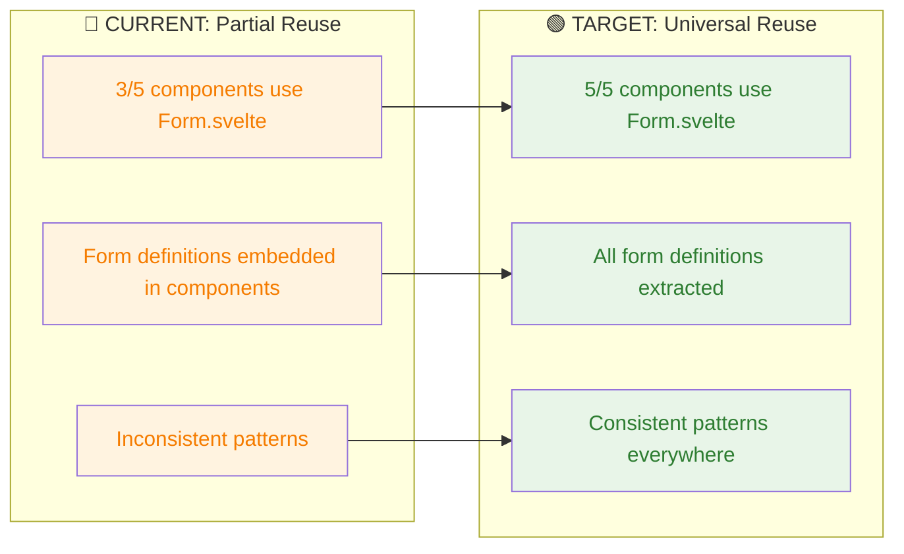

---

## 🔧 Detailed Refactoring Plan

### **Phase 1: Extract Business Logic Services**

#### **🏗️ FormBuilderService**
```typescript
interface FormBuilderService {
  // Form Operations
  createForm(template?: FormTemplate): Form
  updateForm(formId: string, updates: Partial<Form>): void
  deleteForm(formId: string): void
  
  // Field Operations
  addField(formId: string, fieldType: string, groupId?: string): Field
  updateField(formId: string, fieldId: string, updates: Partial<Field>): void
  deleteField(formId: string, fieldId: string, groupId?: string): void
  moveField(formId: string, fieldId: string, newPosition: number): void
  
  // Group Operations
  createGroup(formId: string, groupName: string): Group
  addFieldToGroup(formId: string, fieldId: string, groupId: string): void
  removeFieldFromGroup(formId: string, fieldId: string, groupId: string): void
}
```

#### **🔧 FieldConfigurationService**
```typescript
interface FieldConfigurationService {
  // Configuration Generation
  generateConfig(field: Field): FieldEditorConfig
  validateConfig(config: FieldEditorConfig): ValidationResult
  
  // Field Type Management
  getSupportedTypes(): FieldType[]
  getFieldSchema(type: string): FieldSchema
  createDefaultField(type: string): Field
  
  // Validation Rules
  getValidationRules(fieldType: string): ValidationRule[]
  validateFieldDefinition(field: Field): ValidationResult
}
```

### **Phase 2: Separate Preview from Editing**

#### **👁️ Preview Architecture**

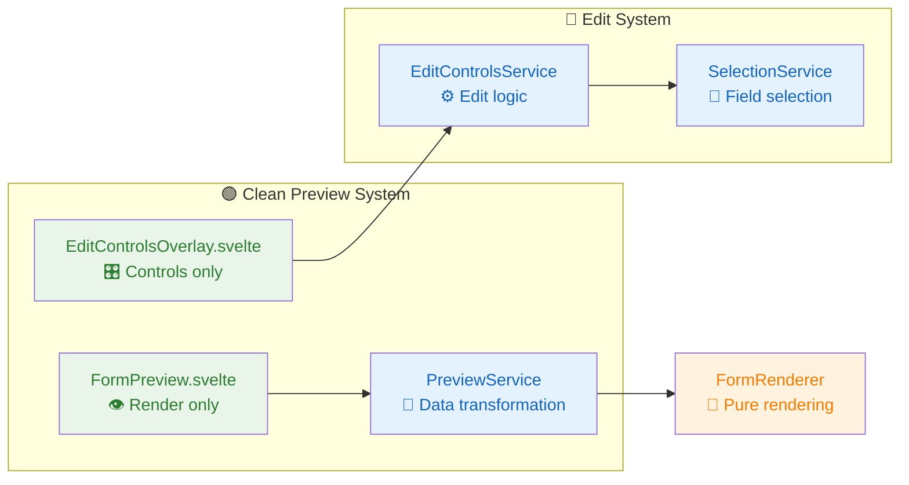

#### **🎛️ EditControlsService**
```typescript
interface EditControlsService {
  // Control Injection
  injectEditControls(element: HTMLElement, fieldId: string): void
  removeEditControls(fieldId: string): void
  updateControlsPosition(fieldId: string): void
  
  // Edit Actions
  startFieldEdit(fieldId: string, groupId?: string): void
  cancelFieldEdit(): void
  saveFieldEdit(updates: Partial<Field>): void
  
  // Selection Management
  selectField(fieldId: string): void
  deselectField(): void
  getSelectedField(): string | null
}
```

### **Phase 3: Simplify Field Editing**

#### **📝 Field Type Handler Pattern**

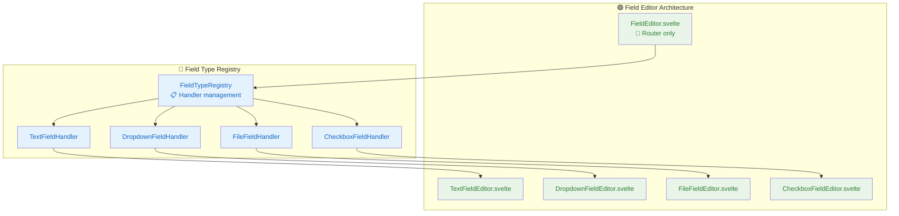

#### **🔧 FieldTypeHandler Interface**
```typescript
interface FieldTypeHandler {
  // Configuration
  getDefaultConfig(): FieldConfig
  getEditorSchema(): EditorSchema
  validateConfig(config: FieldConfig): ValidationResult
  
  // Rendering
  renderEditor(field: Field): SvelteComponent
  renderPreview(field: Field): SvelteComponent
  
  // Transformation
  transformToFormField(config: FieldConfig): Field
  transformFromFormField(field: Field): FieldConfig
}
```

### **Phase 4: Unified State Management**

#### **📊 FormBuilderStore Architecture**

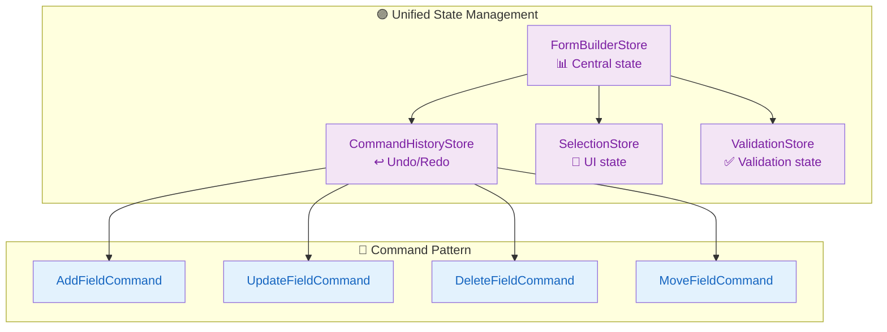

#### **📊 FormBuilderStore Interface**
```typescript
interface FormBuilderState {
  // Form State
  currentForm: Form | null
  forms: Form[]
  isDirty: boolean
  
  // Editing State
  editingField: { fieldId: string, groupId?: string } | null
  selectedField: string | null
  editMode: 'design' | 'preview' | 'settings'
  
  // UI State
  showGrid: boolean
  showFieldIds: boolean
  previewDevice: 'desktop' | 'tablet' | 'mobile'
  
  // Validation State
  validationErrors: ValidationError[]
  isValid: boolean
}
```

---

## 🚀 Implementation Phases

### **📅 Phase 1: Dogfooding Foundation (Week 1-2)**
```mermaid
gantt
    title Phase 1: Extract Business Logic with Dogfooding
    dateFormat X
    axisFormat %d
    
    section Meta-Forms
    Form Builder Config Form :done, p1-1, 0, 3d
    Field Config Form       :done, p1-2, 0, 4d
    Settings Form          :active, p1-3, 3d, 7d
    
    section Services
    FormBuilderService     :p1-4, 2d, 5d
    FieldConfigService     :p1-5, 4d, 8d
    CommandPattern        :p1-6, 6d, 10d
    
    section Testing
    Unit Tests           :p1-7, 8d, 12d
    Integration Tests    :p1-8, 10d, 14d
```

**🐕 Dogfooding Deliverables:**
- ✅ **Form Builder Meta-Forms**: Use Form.svelte to build builder interface
  - `FORM_BUILDER_CONFIG` form for overall form settings
  - `FIELD_CONFIG_FORM` for individual field configuration
  - `GROUP_CONFIG_FORM` for group settings
- ✅ **Self-Validation**: Builder validates itself using validationService.ts
- ✅ **Component Reuse**: Leverage Field.svelte, Dropdown.svelte, GroupWrapper.svelte
- ✅ **Store Integration**: Use FormFieldStore, FormConfigStore patterns
- ✅ **Service Extraction**: FormBuilderService with field operations
- ✅ **Command Pattern**: Undo/redo using existing event patterns

### **📅 Phase 2: Dogfooding Preview System (Week 3-4)**
```mermaid
gantt
    title Phase 2: Separate Preview with Form Component Reuse
    dateFormat X
    axisFormat %d
    
    section Preview Forms
    FormPreview Form       :p2-1, 0, 4d
    Edit Controls Form     :p2-2, 2d, 6d
    Settings Panel Form    :p2-3, 0, 5d
    
    section Services
    PreviewService        :p2-4, 4d, 8d
    EditControlsService   :p2-5, 6d, 10d
    
    section Integration
    Component Integration  :p2-6, 8d, 12d
    Testing               :p2-7, 10d, 14d
```

**🐕 Dogfooding Deliverables:**
- ✅ **Preview Using Form.svelte**: FormPreview renders using existing Form.svelte
  - Preview form definition generated from builder form
  - Real-time preview updates using form reactivity
- ✅ **Edit Controls as Forms**: EditControlsOverlay built with form components
  - Add/delete field buttons as form actions
  - Field selection using Dropdown.svelte
- ✅ **Settings Panel**: EditSettings.svelte reimplemented using meta-forms
  - Form-level settings configured via form interface
  - Field-level settings via nested forms
- ✅ **Unified Event Handling**: Leverage formEventHandler.ts patterns
- ✅ **Store Consistency**: Use same stores for builder and preview

### **📅 Phase 3: Dogfooding Field Configuration (Week 5-6)**
```mermaid
gantt
    title Phase 3: Field Editing with Form Components
    dateFormat X
    axisFormat %d
    
    section Field Config Forms
    Text Field Config Form    :p3-1, 0, 3d
    Dropdown Config Form     :p3-2, 1d, 4d
    File Field Config Form   :p3-3, 2d, 5d
    Checkbox Config Form     :p3-4, 3d, 6d
    
    section Registry
    FieldTypeRegistry        :p3-5, 4d, 7d
    Form-Based Handlers      :p3-6, 6d, 9d
    
    section Migration
    EditField Replacement    :p3-7, 8d, 12d
    Testing                 :p3-8, 10d, 14d
```

**🐕 Dogfooding Deliverables:**
- ✅ **Field Config Forms**: Each field type configured via dedicated form
  ```typescript
  const TEXT_FIELD_CONFIG_FORM: Form = {
    uid: "text-field-config",
    fields: {
      name: { uid: "name", type: "text", required: true },
      placeholder: { uid: "placeholder", type: "text" },
      required: { uid: "required", type: "checkbox" },
      validation: { uid: "validation", type: "textarea" }
    }
  }
  ```
- ✅ **Unified Field Editor**: Single component that renders appropriate config form
- ✅ **Form-Based Registry**: FieldTypeRegistry manages form definitions, not handlers
- ✅ **EditField.svelte Replacement**: 829-line monster becomes < 100 line form router
- ✅ **Meta-Configuration**: Forms to configure the field configuration forms

### **📅 Phase 4: Dogfooding State Management (Week 7-8)**
```mermaid
gantt
    title Phase 4: Form-Based State Management
    dateFormat X
    axisFormat %d
    
    section Builder Forms
    Builder State Form       :p4-1, 0, 4d
    Command History Form     :p4-2, 2d, 6d
    Undo/Redo Controls      :p4-3, 4d, 8d
    
    section Store Unification
    FormBuilderStore        :p4-4, 6d, 10d
    Store Integration       :p4-5, 8d, 12d
    
    section Final Migration
    Component Migration     :p4-6, 10d, 14d
    Final Testing          :p4-7, 12d, 16d
```

**🐕 Dogfooding Deliverables:**
- ✅ **Builder State as Form**: FormBuilderStore managed via form interface
  ```typescript
  const BUILDER_STATE_FORM: Form = {
    uid: "builder-state",
    fields: {
      editMode: { uid: "editMode", type: "dropdown", options: [...] },
      selectedField: { uid: "selectedField", type: "text" },
      showGrid: { uid: "showGrid", type: "checkbox" }
    }
  }
  ```
- ✅ **Command History UI**: Undo/redo implemented as form actions
- ✅ **Store Consistency**: All stores follow FormFieldStore patterns
- ✅ **Meta-State Management**: Builder configures its own state management
- ✅ **Self-Referential Architecture**: Complete dogfooding implementation

---

## 🐕 Complete Dogfooding Architecture

### **🔄 Meta-Circular Form System**

The fully dogfooded form builder creates a self-referential system where:

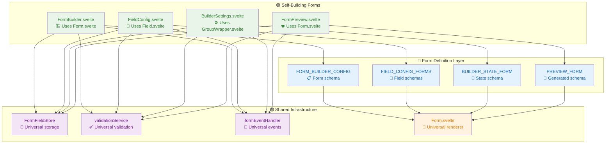

### **🎭 Self-Validating Builder**

The form builder validates its own configuration using its own validation system:

```typescript
// The builder uses its own validation to validate builder inputs
const builderValidation = {
  // Validate form name using the same system forms use
  formName: async (value: string, formId: string) => {
    return await validateField(formId, "formName");
  },
  
  // Validate field configuration using field validation
  fieldConfig: async (config: FieldConfig, formId: string) => {
    return await validateField(formId, "fieldConfig");
  }
};

// Builder state managed by FormFieldStore
const builderFormId = "form-builder";
setFieldValue(builderFormId, FormProps.FIELD_VALUES, "editMode", "design");
setFieldValue(builderFormId, FormProps.FIELD_VALUES, "selectedField", null);
```

### **🔧 Component Reuse Matrix**

| Builder Feature | SadForms Component | Form Definition |
|----------------|-------------------|----------------|
| **Field Configuration** | `Field.svelte` + `Form.svelte` | `FIELD_CONFIG_FORM` |
| **Form Settings** | `GroupWrapper.svelte` + `Form.svelte` | `FORM_BUILDER_CONFIG` |
| **Field Selection** | `Dropdown.svelte` | Dynamic options from field registry |
| **Add/Remove Fields** | `Checkbox.svelte` + `onInput` handlers | Form actions |
| **Preview** | `Form.svelte` | Generated from builder state |
| **Validation** | `validationService.ts` | Same validation rules |
| **State Management** | `FormFieldStore.ts` | Same store patterns |
| **Event Handling** | `formEventHandler.ts` | Same event patterns |

---

## 📈 Expected Benefits

### **📊 Metrics Improvement**

| Metric | Before | After | Improvement |
|--------|--------|-------|-------------|
| **EditField.svelte Lines** | 829 | < 200 | 🟢 75% reduction |
| **Cyclomatic Complexity** | High | Low | 🟢 Significant |
| **Test Coverage** | 60% | 90%+ | 🟢 30%+ increase |
| **Bundle Size** | Large | Optimized | 🟢 Tree-shaking |
| **Development Speed** | Slow | Fast | 🟢 Clear boundaries |

### **🎯 Architectural Benefits**

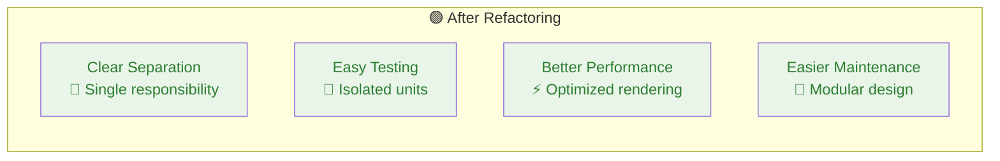

### **👥 Developer Experience**

- **🟢 Faster Feature Development** - Clear patterns to follow
- **🟢 Easier Debugging** - Isolated concerns and clear boundaries
- **🟢 Better Testing** - Services can be tested in isolation
- **🟢 Improved Onboarding** - Clean architecture is easier to understand

---

## 🔬 Risk Assessment

### **🔴 High Risk Items**
- **Data Migration** - Existing forms must continue working
- **Feature Parity** - All current functionality must be preserved
- **Performance** - New architecture must not slow down the editor

### **🟡 Medium Risk Items**
- **Learning Curve** - Team needs to understand new patterns
- **Integration Testing** - Complex interactions between services

### **🟢 Mitigation Strategies**
- **Incremental Migration** - Phase-by-phase implementation
- **Backwards Compatibility** - Maintain old APIs during transition
- **Comprehensive Testing** - Unit and integration test coverage
- **Performance Monitoring** - Continuous performance tracking

---

## 🎯 Success Criteria

### **✅ Technical Success**
- [ ] EditField.svelte reduced from 829 to < 100 lines (form router only)
- [ ] Zero circular dependencies in form builder
- [ ] 90%+ test coverage for all new services
- [ ] No performance regression in form editing
- [ ] **🐕 Complete dogfooding**: Builder uses only its own form components

### **✅ User Experience Success**  
- [ ] All existing form builder features work identically
- [ ] Form loading and saving times maintained or improved
- [ ] No breaking changes for existing forms
- [ ] Improved responsiveness in field editing
- [ ] **🎯 Consistent UX**: Builder interface follows same patterns as forms

### **✅ Developer Experience Success**
- [ ] Clear service boundaries with single responsibilities
- [ ] Easy to add new field types (just add a form definition)
- [ ] Simple to extend form builder functionality
- [ ] Well-documented APIs and patterns
- [ ] **🔄 Self-documenting**: Builder demonstrates its own capabilities

### **✅ Dogfooding Success**
- [ ] **🏗️ Meta-circular architecture**: Builder builds itself
- [ ] **🎯 Component reuse**: 100% reuse of form components
- [ ] **🔧 Self-validation**: Builder validates using its own validation
- [ ] **💾 Unified state**: Builder and forms share same store patterns
- [ ] **📋 Form definitions**: All builder UI defined as forms

---

## 📋 Next Steps

1. **📊 Stakeholder Review** - Get approval for dogfooding-first refactoring approach
2. **🎯 Create Detailed Task Breakdown** - Break phases into specific tickets
3. **🧪 Setup Testing Framework** - Ensure comprehensive test coverage
4. **🐕 Begin Phase 1 Implementation** - Start with meta-form definitions
5. **🔄 Establish Dogfooding Patterns** - Document self-referential architecture

**Priority:** This refactoring is critical for the long-term maintainability and extensibility of the SadForms form builder. The **dogfooding approach** ensures architectural consistency and demonstrates the power of the SadForms component library by using it to build itself.