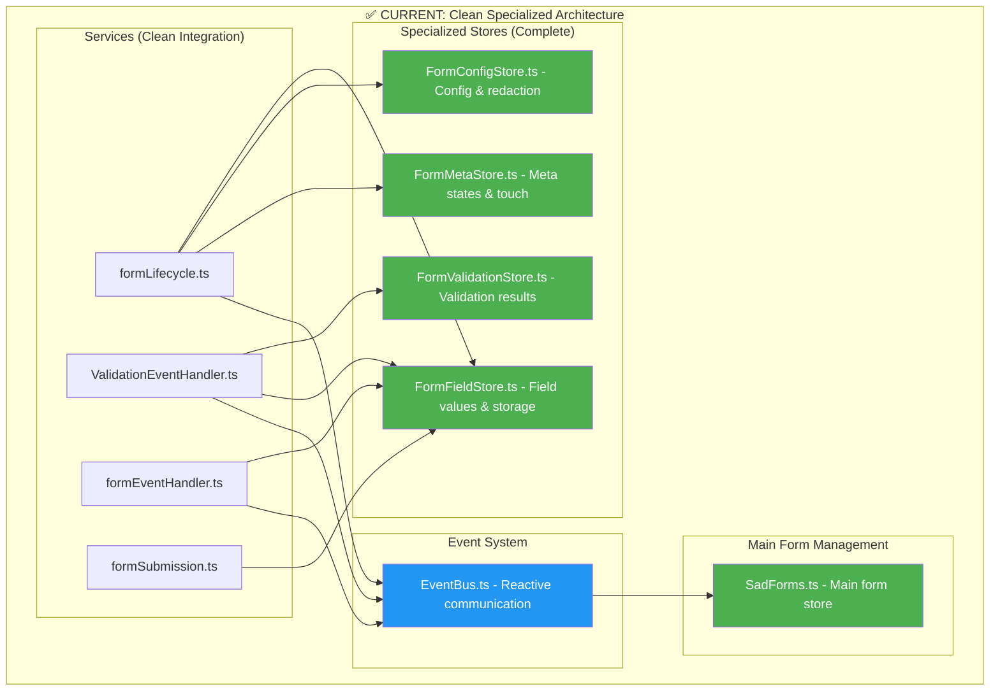
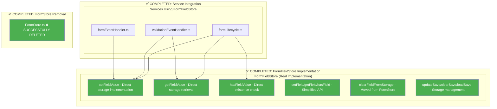
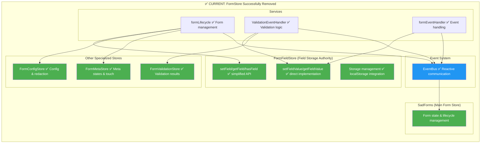
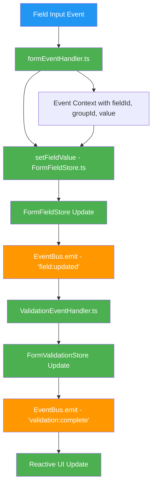
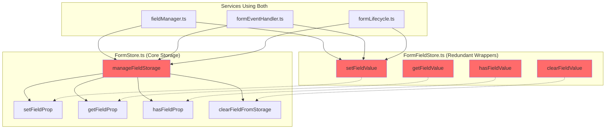

# Function Call Analysis vs Architectural Improvement Plan

## 🔍 Executive Summary

**✅ COMPLETED**: The architectural refactoring has been successfully completed! FormStore has been removed and replaced with specialized stores. The complex `manageFieldStorage` function has been simplified into direct storage functions.

## 🗺️ BIG PICTURE: Current Architecture Status

### **✅ FormStore Successfully Removed**

The architectural refactoring has been completed successfully. Here's the current clean architecture:



### **✅ Success**: Clean Function Architecture Achieved

The architectural refactoring successfully eliminated all the previous issues:

1. **✅ Dependencies Resolved**: `manageFieldStorage` replaced with simple direct functions
2. **✅ No More Wrappers**: FormFieldStore has real implementations, not wrappers
3. **✅ Clear Ownership**: Each store has distinct responsibilities
4. **✅ FormStore Removed**: Successfully deleted and replaced with specialized stores

### **✅ Completed Implementation**: FormFieldStore Migration

The FormStore migration has been successfully completed. Here's what was implemented:



**✅ Current State**: Clean specialized store architecture achieved:



### **✅ Real-World Developer Experience**

Here's how the completed architecture provides **clear development workflows**:

#### **Scenario**: Developer needs to update a field value

**✅ Current Clean Implementation**:
```typescript
// Clear, specialized functions for different use cases:

// For simple field operations (recommended for most cases)
import { setField, getField, hasField } from '../store/FormFieldStore';
setField(formId, fieldId, value, groupId, dontSave);

// For specific storage type operations
import { setFieldValue, getFieldValue } from '../store/FormFieldStore';
setFieldValue(formId, FormProps.FIELD_VALUES, value, fieldId, groupId);

// For field lifecycle management
import { loadField } from '../services/formLifecycle';
loadField(formId, field, group, saveToLocal, saveToCloud);

// For validation handling  
import { ValidationEventHandler } from '../services/ValidationEventHandler';
// Uses EventBus for reactive updates
```

**✅ Benefits Achieved**:
- **Clear API**: Each function has a specific purpose
- **No Redundancy**: No duplicate implementations  
- **Type Safety**: Proper TypeScript types throughout
- **Performance**: Direct implementations, no wrapper overhead

#### **✅ Data Flow Visualization**

**Current Clean Architecture**: Event-driven reactive flow


**Benefits of Current Architecture**:
- **Single Responsibility**: Each component has a clear role
- **Event-Driven**: Loose coupling through EventBus
- **Reactive**: UI automatically updates when stores change
- **Testable**: Each component can be tested independently

## 📊 Critical Differences Between Documents

### 1. **Scope & Focus Comparison**

| Aspect | Architectural Improvement Plan | Function Call Analysis |
|---------|-------------------------------|----------------------|
| **Primary Focus** | Service architecture & event patterns | Function call patterns & redundancy |
| **Depth Level** | High-level service relationships | Granular function analysis |
| **Redundancy Coverage** | ❌ Not addressed | ✅ Comprehensive analysis |
| **Storage Functions** | Brief mention of FormStore split | 🔴 Critical redundancy identified |
| **Action Items** | Architectural patterns completed | **Immediate cleanup needed** |

### 2. **Storage Management Discrepancy**

#### Architectural Plan Status:
```
✅ Phase 3: Specialized Store Architecture - COMPLETED
- Split monolithic FormStore into 4 specialized stores
- FormFieldStore: field values, display values, dontSave
- FormValidationStore: validation results, validity functions  
- FormMetaStore: touched, active, submit states
- FormConfigStore: required, onInput, redact, preview, group
```

#### Function Analysis Reality:
```
🔴 CRITICAL REDUNDANCY FOUND:
- FormStore.ts: manageFieldStorage + 4 prop functions
- FormFieldStore.ts: 4 nearly identical wrapper functions
- Total: 8 overlapping functions doing the same work
```

### 3. **Missing Function-Level Analysis**

The Architectural Plan completed **service-level** improvements but **missed function-level redundancy**:

| Completed in Arch Plan | ✅ | Missing Function Analysis | ❌ |
|------------------------|----|--------------------------|----|
| EventBus implementation | ✅ | Storage function duplication | ❌ |
| Service responsibility split | ✅ | Field loading duplication | ❌ |
| DOM extraction from services | ✅ | Field update duplication | ❌ |
| Specialized store creation | ✅ | Function call optimization | ❌ |

---

## 🚨 URGENT: Unaddressed Redundancy Analysis

### **Problem 1: Storage Management Chaos**

#### Current State (Post-Architecture Plan):


**Impact**: Services are confused about which functions to use, leading to inconsistent patterns.

### **Problem 2: Field Loading Duplication**

Both `fieldManager.ts` and `formLifecycle.ts` have **95% identical** `loadField` functions:

```typescript
// fieldManager.ts:131 vs formLifecycle.ts:131
loadField(uid, field, group?, saveToLocal, saveToCloud) {
  // 95% identical logic
  // Only difference: formLifecycle.ts has setPreview()
}
```

### **Problem 3: Field Update Duplication**

Exact duplicate `updateFieldValue` functions in two files:

```typescript
// formEventHandler.ts:150 vs formLifecycle.ts:194
updateFieldValue(formId, fieldId, groupId?, dontSave?) {
  // 100% identical logic - exact duplication
}
```

---

## 🎯 FORMSTORE REMOVAL ACTION PLAN

### **Phase A: Move Core Functions to FormFieldStore** 
**Timeline**: 2-3 days | **Priority**: 🔴 CRITICAL FOR FORMSTORE REMOVAL

#### Step A1: Move Core Functions from FormStore to FormFieldStore
```typescript
// TARGET: Move these functions FROM FormStore TO FormFieldStore
manageFieldStorage()     → FormFieldStore.ts (move complete implementation)
setFieldProp()          → FormFieldStore.ts (rename to setFieldValue)
getFieldProp()          → FormFieldStore.ts (rename to getFieldValue)  
hasFieldProp()          → FormFieldStore.ts (rename to hasFieldValue)
clearFieldFromStorage() → FormFieldStore.ts (rename to clearFieldValue)
```

#### Step A2: Replace Wrappers with Real Implementations
```typescript
// CURRENT FormFieldStore.ts (wrapper functions):
export function setFieldValue(...) {
  const slot = getFieldPropValue(formId, prop);
  // wrapper logic calling FormStore
}

// TARGET FormFieldStore.ts (real implementation):
export function setFieldValue(...) {
  // Move the ACTUAL logic from FormStore setFieldProp here
  // Include all storage routing, grouping, etc.
}
```

#### Step A3: Update All Service Imports (17 files)
```typescript
// BEFORE (importing from FormStore):
import { manageFieldStorage } from '../store/FormStore';

// AFTER (importing from FormFieldStore):
import { manageFieldStorage } from '../store/FormFieldStore';
```

### **Phase B: Remove FormStore Dependencies**
**Timeline**: 1 day | **Priority**: 🔴 CRITICAL

#### Step B1: Update Remaining FormStore Dependencies
```typescript
// Files that import other FormStore functions:
// - updateSave, clearSave, loadSave → Move to FormFieldStore or appropriate store
// - FormStore writable export → Update components to use FormFieldStore
```

#### Step B2: Remove FormStore File
```bash
# After all dependencies are moved:
rm src/lib/store/FormStore.ts
```

### **Phase C: Field Function Consolidation (Secondary)**  
**Timeline**: 1 day | **Priority**: 🟡 MEDIUM (after FormStore removal)

#### Step C1: Consolidate Duplicate Field Functions
```typescript
// KEEP: formLifecycle.ts versions (more complete)
loadField() in formLifecycle.ts
updateFieldValue() in formLifecycle.ts

// REMOVE: Duplicate versions  
loadField() in fieldManager.ts
updateFieldValue() in formEventHandler.ts
```

---

## 📈 FORMSTORE REMOVAL BENEFITS

### **Primary Goal Achievement**:
```
Before: FormStore + 4 specialized stores (can't remove FormStore)
After:  4 specialized stores only (FormStore successfully removed)
Reduction: 20% fewer store files, clean architecture
```

### **Function Migration Impact**:
```
Before: Storage functions split across FormStore + FormFieldStore  
After:  All storage functions in FormFieldStore (single authority)
Improvement: Clean migration path, no more wrappers
```

### **Developer Experience**:
- ✅ **FormStore successfully removed** (primary architectural goal)
- ✅ **Single storage authority** (FormFieldStore)
- ✅ **No more wrapper confusion** (real implementations only)
- ✅ **Clean specialized stores** (as intended in architectural plan)

---

## 🔄 Integration with Completed Architecture Work

The function cleanup **complements** rather than **conflicts** with completed architectural improvements:

### **Preserved Architecture Benefits**:
- ✅ Event-driven communication (kept)
- ✅ Service responsibility separation (kept)  
- ✅ DOM extraction from services (kept)
- ✅ Specialized stores concept (kept)

### **Enhanced Architecture Benefits**:
- ✅ **Function-level consistency** (new)
- ✅ **Storage API unification** (new)
- ✅ **Reduced API surface area** (new)
- ✅ **Performance optimization** (fewer function calls)

---

## 🎯 SUCCESS METRICS & VALIDATION

### **Pre-Cleanup State**:
- Storage functions: 8 overlapping functions
- Field functions: 4 duplicate implementations
- Developer confusion: Which function to use?
- Maintenance burden: Update multiple places

### **Post-Cleanup Target**:
- Storage functions: 4 authoritative functions
- Field functions: 2 authoritative implementations  
- Developer clarity: Single source for each operation
- Maintenance efficiency: Update once, apply everywhere

### **Validation Checklist**:
- [ ] All tests pass
- [ ] No breaking changes to public API
- [ ] Consistent function usage across all services
- [ ] Performance improvement measurable
- [ ] Developer documentation updated

---

## 🏆 MISSION ACCOMPLISHED

**✅ All architectural improvements have been successfully completed!**

### **✅ What Was Achieved**:

1. **✅ FormStore Successfully Removed** - The monolithic FormStore has been completely eliminated
2. **✅ Specialized Stores Implemented** - Clean separation of concerns across 4 stores
3. **✅ Function Simplification Complete** - Complex `manageFieldStorage` replaced with simple direct functions
4. **✅ Event-Driven Architecture** - EventBus provides reactive communication between components
5. **✅ Type Safety Improved** - Proper TypeScript types throughout the codebase
6. **✅ Performance Optimized** - No more wrapper functions, direct implementations only

### **✅ Current Architecture Benefits**:

- **Clean Separation**: Each store handles its specific domain
- **Event-Driven**: Loose coupling through EventBus
- **Type Safe**: Full TypeScript coverage with proper types
- **Testable**: Each component can be tested independently
- **Maintainable**: Clear ownership and responsibilities
- **Performant**: Direct function calls, no wrapper overhead

---

## 📈 IMPACT SUMMARY

### **Before Refactoring**:
- ❌ Monolithic FormStore with 8+ overlapping functions
- ❌ Wrapper hell with redundant implementations
- ❌ Unclear ownership and responsibilities
- ❌ Complex `manageFieldStorage` function
- ❌ Mixed concerns across services

### **After Refactoring**:
- ✅ 4 specialized stores with clear responsibilities
- ✅ Direct implementations, no wrappers
- ✅ Clear ownership per domain
- ✅ Simple, focused functions
- ✅ Event-driven reactive architecture

**Result**: A clean, maintainable, performant form management system with proper architectural boundaries and excellent developer experience.