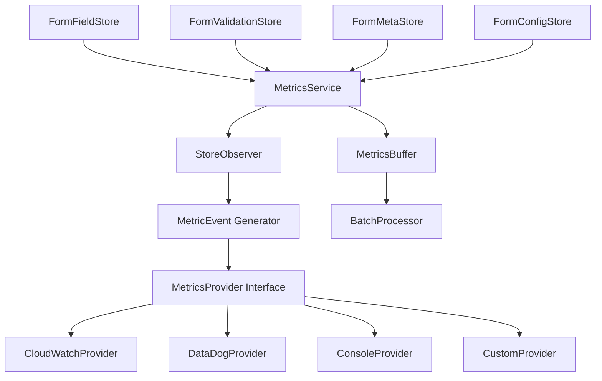

# SadForms Metrics & Performance Logging Service Design

## 📋 Executive Summary

This document outlines the design for a pluggable metrics and performance logging service for SadForms that integrates with the store-based reactive architecture to provide comprehensive observability.

**Key Design Principles:**
- **Store-Based Integration**: Leverage Svelte's reactive stores for metrics collection
- **Provider Agnostic**: Support for any third-party service (AWS CloudWatch, DataDog, New Relic, etc.)
- **Reactive Architecture**: Use store subscriptions for non-invasive data collection
- **Performance First**: Minimal overhead with async operations and batching
- **Type Safe**: Full TypeScript support with strong typing

## 🏗️ Architectural Decision: Store-Based vs EventBus

### EventBus Analysis & Redundancy
Current analysis shows EventBus provides minimal value:
- **Single Consumer**: Only ValidationEventHandler listens to field events
- **No Component Observation**: All components use direct store reactivity (`$FormFieldStore`)
- **Performance Overhead**: Unnecessary event dispatch for simple validation triggering
- **Complexity**: Extra abstraction layer without clear architectural benefit

### Recommended Architecture: Store-Based Metrics
Instead of EventBus, leverage Svelte's reactive store system for metrics collection:
- **Direct Store Observation**: Subscribe to store changes for metrics
- **Reactive Derivations**: Use `derived` stores to trigger metrics collection
- **Zero Overhead**: No intermediate event objects or dispatch mechanism
- **Better Performance**: Direct function calls and store subscriptions

### Store-Based Architecture



### Core Components

1. **MetricsService**: Main orchestrator with store subscriptions
2. **StoreObserver**: Reactive store change detection
3. **MetricsProvider Interface**: Abstraction for third-party services
4. **MetricsBuffer**: Batching and queuing system
5. **MetricEvent Generator**: Transform store changes to metric events
6. **ConfigurationManager**: Runtime configuration and provider switching

## 🔌 Provider Interface Design

### Core Provider Interface

```typescript
interface MetricsProvider {
  // Unique identifier for the provider
  readonly name: string;
  
  // Initialize the provider with configuration
  initialize(config: ProviderConfig): Promise<void>;
  
  // Core metric tracking methods
  trackEvent(event: MetricEvent): Promise<void>;
  trackTiming(metric: TimingMetric): Promise<void>;
  trackCounter(metric: CounterMetric): Promise<void>;
  trackGauge(metric: GaugeMetric): Promise<void>;
  
  // Batch operations for performance
  trackBatch(events: MetricEvent[]): Promise<void>;
  
  // Resource management
  flush(): Promise<void>;
  close(): Promise<void>;
  
  // Health check
  isHealthy(): Promise<boolean>;
}
```

### Provider Configuration

```typescript
interface ProviderConfig {
  // Provider-specific settings
  endpoint?: string;
  apiKey?: string;
  region?: string;
  
  // Batching configuration
  batchSize?: number;
  flushInterval?: number;
  
  // Error handling
  retryAttempts?: number;
  retryDelay?: number;
  
  // Filtering
  eventFilters?: EventFilter[];
  
  // Provider-specific options
  [key: string]: any;
}
```

## 📊 Store Changes → Metrics Mapping

### Metric Event Types

```typescript
interface MetricEvent {
  name: string;
  type: 'counter' | 'timing' | 'gauge' | 'event';
  value: number;
  timestamp: number;
  tags: Record<string, string>;
  metadata?: Record<string, any>;
}

interface TimingMetric extends Omit<MetricEvent, 'type'> {
  type: 'timing';
  duration: number;
  unit: 'ms' | 'seconds';
}

interface CounterMetric extends Omit<MetricEvent, 'type'> {
  type: 'counter';
  increment: number;
}

interface GaugeMetric extends Omit<MetricEvent, 'type'> {
  type: 'gauge';
  value: number;
}
```

### Store Changes → Metrics Mapping

| Store Change | Metric Type | Metric Name | Key Data |
|-------------|-------------|-------------|----------|
| `FormFieldStore` field value change | Counter | `form.field.input` | fieldId, formId, inputLength |
| `FormMetaStore` touch state change | Event | `form.field.focus` | fieldId, formId, timestamp |
| `FormMetaStore` active → touched | Timing | `form.field.focus_duration` | fieldId, duration |
| `FormValidationStore` validation result | Timing | `form.validation.duration` | fieldId, validationType, success |
| `FormValidationStore` validation errors | Counter | `form.validation.failures` | fieldId, errorType |
| `FormFieldStore` submission data | Event | `form.submission.started` | formId, fieldCount |
| Form submission success | Counter | `form.submission.success` | formId, submissionTime |
| Form submission failure | Counter | `form.submission.failures` | formId, failureReason |

## 🎯 MetricsService Implementation

### Core Service Structure

```typescript
class MetricsService {
  private providers: Map<string, MetricsProvider> = new Map();
  private buffer: MetricsBuffer;
  private config: MetricsConfig;
  private storeObserver: StoreObserver;
  private unsubscribeFunctions: (() => void)[] = [];
  
  constructor(config: MetricsConfig) {
    this.config = config;
    this.buffer = new MetricsBuffer(config.bufferConfig);
    this.storeObserver = new StoreObserver(this);
    this.setupStoreSubscriptions();
  }
  
  // Provider management
  addProvider(provider: MetricsProvider): Promise<void>
  removeProvider(name: string): Promise<void>
  
  // Metric tracking
  track(event: MetricEvent): Promise<void>
  trackTiming(name: string, duration: number, tags?: Record<string, string>): Promise<void>
  trackCounter(name: string, increment: number, tags?: Record<string, string>): Promise<void>
  
  // Lifecycle management
  start(): Promise<void>
  stop(): Promise<void>
  flush(): Promise<void>
}
```

### Store Subscription Setup

```typescript
class StoreObserver {
  constructor(private metricsService: MetricsService) {}
  
  setupStoreSubscriptions(): void {
    // Subscribe to field value changes
    const fieldStoreUnsubscribe = FormFieldStore.subscribe((stores) => {
      this.handleFieldStoreChange(stores);
    });
    
    // Subscribe to validation result changes
    const validationStoreUnsubscribe = FormValidationStore.subscribe((stores) => {
      this.handleValidationStoreChange(stores);
    });
    
    // Subscribe to meta state changes (touch, focus, etc.)
    const metaStoreUnsubscribe = FormMetaStore.subscribe((stores) => {
      this.handleMetaStoreChange(stores);
    });
    
    // Track unsubscribe functions for cleanup
    this.unsubscribeFunctions.push(
      fieldStoreUnsubscribe,
      validationStoreUnsubscribe,
      metaStoreUnsubscribe
    );
  }
  
  private handleFieldStoreChange(stores: FormFieldStoreState): void {
    // Detect field value changes and emit metrics
    // Compare with previous state to detect changes
  }
  
  private handleValidationStoreChange(stores: FormValidationStoreState): void {
    // Track validation performance and results
  }
  
  private handleMetaStoreChange(stores: FormMetaStoreState): void {
    // Track user interaction patterns (focus, touch, etc.)
  }
}
```

## 🛠️ Provider Implementations

### AWS CloudWatch Provider

```typescript
class CloudWatchProvider implements MetricsProvider {
  readonly name = 'cloudwatch';
  private cloudWatch: AWS.CloudWatch;
  private namespace: string;
  
  async initialize(config: CloudWatchConfig): Promise<void> {
    this.cloudWatch = new AWS.CloudWatch({
      region: config.region,
      accessKeyId: config.accessKeyId,
      secretAccessKey: config.secretAccessKey
    });
    this.namespace = config.namespace || 'SadForms';
  }
  
  async trackEvent(event: MetricEvent): Promise<void> {
    const params = {
      Namespace: this.namespace,
      MetricData: [{
        MetricName: event.name,
        Value: event.value,
        Unit: this.mapUnit(event.type),
        Timestamp: new Date(event.timestamp),
        Dimensions: this.createDimensions(event.tags)
      }]
    };
    
    await this.cloudWatch.putMetricData(params).promise();
  }
  
  async trackBatch(events: MetricEvent[]): Promise<void> {
    const chunks = this.chunkArray(events, 20); // CloudWatch limit
    
    for (const chunk of chunks) {
      const params = {
        Namespace: this.namespace,
        MetricData: chunk.map(event => ({
          MetricName: event.name,
          Value: event.value,
          Unit: this.mapUnit(event.type),
          Timestamp: new Date(event.timestamp),
          Dimensions: this.createDimensions(event.tags)
        }))
      };
      
      await this.cloudWatch.putMetricData(params).promise();
    }
  }
}
```

### DataDog Provider

```typescript
class DataDogProvider implements MetricsProvider {
  readonly name = 'datadog';
  private client: StatsD;
  
  async initialize(config: DataDogConfig): Promise<void> {
    this.client = new StatsD({
      host: config.host || 'localhost',
      port: config.port || 8125,
      prefix: config.prefix || 'sadforms.',
      globalTags: config.globalTags || []
    });
  }
  
  async trackCounter(metric: CounterMetric): Promise<void> {
    this.client.increment(metric.name, metric.increment, this.formatTags(metric.tags));
  }
  
  async trackTiming(metric: TimingMetric): Promise<void> {
    this.client.timing(metric.name, metric.duration, this.formatTags(metric.tags));
  }
  
  async trackGauge(metric: GaugeMetric): Promise<void> {
    this.client.gauge(metric.name, metric.value, this.formatTags(metric.tags));
  }
}
```

### Console Provider (Development)

```typescript
class ConsoleProvider implements MetricsProvider {
  readonly name = 'console';
  
  async initialize(config: ConsoleConfig): Promise<void> {
    // No initialization needed
  }
  
  async trackEvent(event: MetricEvent): Promise<void> {
    console.log(`[METRIC] ${event.type.toUpperCase()}: ${event.name}`, {
      value: event.value,
      tags: event.tags,
      timestamp: new Date(event.timestamp).toISOString()
    });
  }
  
  async trackBatch(events: MetricEvent[]): Promise<void> {
    console.group(`[METRICS BATCH] ${events.length} events`);
    for (const event of events) {
      await this.trackEvent(event);
    }
    console.groupEnd();
  }
}
```

## 🚀 Usage Examples

### Basic Setup

```typescript
// Initialize metrics service
const metricsConfig = {
  bufferConfig: {
    maxSize: 1000,
    flushInterval: 5000 // 5 seconds
  },
  providers: [
    {
      name: 'cloudwatch',
      config: {
        region: 'us-east-1',
        namespace: 'SadForms/Production'
      }
    }
  ]
};

const metricsService = new MetricsService(metricsConfig);

// Add providers
await metricsService.addProvider(new CloudWatchProvider());
await metricsService.addProvider(new ConsoleProvider());

// Start collecting metrics (sets up store subscriptions)
await metricsService.start();
```

### Multi-Provider Setup

```typescript
// Production: CloudWatch + DataDog
if (process.env.NODE_ENV === 'production') {
  await metricsService.addProvider(new CloudWatchProvider());
  await metricsService.addProvider(new DataDogProvider());
}

// Development: Console only
if (process.env.NODE_ENV === 'development') {
  await metricsService.addProvider(new ConsoleProvider());
}

// Custom provider for internal analytics
await metricsService.addProvider(new InternalAnalyticsProvider());
```

### Custom Metrics

```typescript
// Track custom business metrics
metricsService.trackCounter('form.conversions', 1, {
  formType: 'registration',
  source: 'landing-page'
});

// Track performance metrics
metricsService.trackTiming('form.render_time', renderDuration, {
  formId: 'user-signup',
  fieldCount: '12'
});
```

## 🔧 Configuration Management

### Runtime Configuration

```typescript
interface MetricsConfig {
  enabled: boolean;
  
  // Buffer configuration
  bufferConfig: {
    maxSize: number;
    flushInterval: number;
    maxRetries: number;
  };
  
  // Global tags applied to all metrics
  globalTags: Record<string, string>;
  
  // Event filtering
  eventFilters: EventFilter[];
  
  // Provider configurations
  providers: ProviderConfiguration[];
  
  // Sampling rate (0-1)
  samplingRate: number;
}

interface EventFilter {
  eventType?: string;
  fieldPattern?: RegExp;
  formPattern?: RegExp;
  action: 'include' | 'exclude';
}
```

### Environment-Based Configuration

```typescript
// Production configuration
const productionConfig: MetricsConfig = {
  enabled: true,
  samplingRate: 1.0,
  bufferConfig: {
    maxSize: 5000,
    flushInterval: 30000,
    maxRetries: 3
  },
  providers: [
    { name: 'cloudwatch', config: { /* CloudWatch config */ } },
    { name: 'datadog', config: { /* DataDog config */ } }
  ]
};

// Development configuration
const developmentConfig: MetricsConfig = {
  enabled: true,
  samplingRate: 0.1, // Sample 10% of events
  bufferConfig: {
    maxSize: 100,
    flushInterval: 5000,
    maxRetries: 1
  },
  providers: [
    { name: 'console', config: {} }
  ]
};
```

## 📈 Performance Considerations

### Batching Strategy

```typescript
class MetricsBuffer {
  private buffer: MetricEvent[] = [];
  private timer: NodeJS.Timeout | null = null;
  
  constructor(private config: BufferConfig) {}
  
  add(event: MetricEvent): void {
    this.buffer.push(event);
    
    if (this.buffer.length >= this.config.maxSize) {
      this.flush();
    } else if (!this.timer) {
      this.timer = setTimeout(() => this.flush(), this.config.flushInterval);
    }
  }
  
  private async flush(): Promise<void> {
    if (this.buffer.length === 0) return;
    
    const events = this.buffer.splice(0);
    this.clearTimer();
    
    // Send to all providers in parallel
    await Promise.allSettled(
      this.providers.map(provider => provider.trackBatch(events))
    );
  }
}
```

### Sampling & Filtering

```typescript
class MetricsService {
  private shouldSample(): boolean {
    return Math.random() < this.config.samplingRate;
  }
  
  private shouldInclude(event: FormEvent): boolean {
    return this.config.eventFilters.every(filter => {
      if (filter.action === 'exclude') {
        return !this.matchesFilter(event, filter);
      } else {
        return this.matchesFilter(event, filter);
      }
    });
  }
  
  track(event: MetricEvent): Promise<void> {
    if (!this.config.enabled || !this.shouldSample()) {
      return Promise.resolve();
    }
    
    return this.buffer.add(event);
  }
}
```

## 🧪 Testing Strategy

### Unit Testing

```typescript
describe('MetricsService', () => {
  let metricsService: MetricsService;
  let mockProvider: MockMetricsProvider;
  let mockFormFieldStore: MockWritable<any>;
  
  beforeEach(() => {
    mockProvider = new MockMetricsProvider();
    mockFormFieldStore = new MockWritable({});
    metricsService = new MetricsService(testConfig);
    metricsService.addProvider(mockProvider);
  });
  
  it('should track field value changes from store', async () => {
    // Simulate store change
    mockFormFieldStore.set({
      'test-form': {
        fieldValues: {
          'test-field': 'new-value'
        }
      }
    });
    
    // Wait for reactive update
    await tick();
    
    expect(mockProvider.trackEvent).toHaveBeenCalledWith(
      expect.objectContaining({
        name: 'form.field.input',
        type: 'counter'
      })
    );
  });
});
```

### Integration Testing

```typescript
describe('MetricsService Integration', () => {
  it('should collect metrics during form interaction', async () => {
    const testForm = new TestFormBuilder()
      .addField('email', 'text')
      .addValidation('email', emailValidator)
      .build();
    
    // Simulate user interaction (will trigger store changes)
    await testForm.fillField('email', 'user@example.com');
    await testForm.submit();
    
    // Verify metrics were collected from store observations
    expect(metricsService.getCollectedMetrics()).toContainEqual(
      expect.objectContaining({
        name: 'form.field.input',
        tags: { fieldId: 'email' }
      })
    );
  });
});
```

## 🔒 Security & Privacy

### Data Sanitization

```typescript
class DataSanitizer {
  static sanitizeFieldValue(value: any, fieldType: string): any {
    // Remove PII from field values
    if (fieldType === 'password' || fieldType === 'ssn') {
      return '[REDACTED]';
    }
    
    if (fieldType === 'email') {
      return this.hashEmail(value);
    }
    
    return typeof value === 'string' ? value.substring(0, 50) : value;
  }
  
  static sanitizeTags(tags: Record<string, string>): Record<string, string> {
    const sanitized: Record<string, string> = {};
    
    for (const [key, value] of Object.entries(tags)) {
      if (this.isPIIField(key)) {
        sanitized[key] = '[REDACTED]';
      } else {
        sanitized[key] = value;
      }
    }
    
    return sanitized;
  }
}
```

### Configuration Security

```typescript
interface SecureProviderConfig {
  // Encrypted credentials
  encryptedApiKey?: string;
  
  // Environment variable references
  apiKeyEnv?: string;
  
  // Data retention policies
  dataRetention?: {
    days: number;
    autoDelete: boolean;
  };
  
  // PII handling
  piiHandling: {
    sanitize: boolean;
    fieldBlacklist: string[];
    hashSensitiveData: boolean;
  };
}
```

## 🚀 Migration & Rollout Plan

### Phase 1: EventBus Removal & Store Foundation (Week 1-2)
- Remove EventBus and ValidationEventHandler
- Refactor form handlers to use direct function calls
- Implement core MetricsService with store subscriptions
- Add Console provider for development testing

### Phase 2: Store-Based Metrics (Week 3-4)
- Implement StoreObserver for reactive metrics collection
- Add AWS CloudWatch provider
- Implement batching and buffering system
- Set up configuration management

### Phase 3: Advanced Features (Week 5-6)
- Add DataDog and other providers
- Implement sampling and filtering
- Add performance monitoring and health checks
- Optimize store change detection

### Phase 4: Production Ready (Week 7-8)
- Security audit and PII sanitization
- Comprehensive testing suite
- Performance optimization and memory management
- Documentation and deployment guides

### EventBus Removal Benefits
- **Performance**: Eliminate event dispatch overhead
- **Simplicity**: Direct function calls instead of event abstraction
- **Memory**: Reduce object creation and event listener maps
- **Debugging**: Cleaner stack traces and better error handling

## 📚 Documentation & Examples

### Provider Development Guide

```typescript
// Custom provider implementation template
class CustomProvider implements MetricsProvider {
  readonly name = 'custom';
  
  async initialize(config: CustomConfig): Promise<void> {
    // Initialize your service client
  }
  
  async trackEvent(event: MetricEvent): Promise<void> {
    // Send event to your service
  }
  
  // Implement other required methods...
}
```

### Integration Examples

- **E-commerce Form**: Track conversion funnels and abandonment points
- **Registration Flow**: Monitor validation errors and completion rates
- **Survey Platform**: Analyze user engagement and response patterns
- **Contact Forms**: Track spam detection and successful submissions

## 🎯 Success Metrics

### Key Performance Indicators

1. **System Performance**: <5ms overhead per event
2. **Provider Reliability**: >99.9% successful metric delivery
3. **Memory Usage**: <50MB additional memory footprint
4. **Developer Experience**: <10 lines of code to add new provider

### Business Value Metrics

1. **Form Optimization**: 20% improvement in completion rates
2. **Performance Insights**: Identify 95th percentile response times
3. **User Experience**: Track and reduce validation error rates
4. **Cost Optimization**: Monitor and optimize third-party service usage

---

## 📋 Summary

**This design provides a comprehensive, pluggable metrics system that leverages Svelte's reactive store architecture for optimal performance and simplicity.**

### Key Architectural Decisions

1. **EventBus Removal**: Eliminates unnecessary complexity and performance overhead
2. **Store-Based Reactive Metrics**: Leverages Svelte's efficient reactivity system
3. **Provider Agnostic**: Supports any third-party metrics service
4. **Zero-Impact Integration**: Metrics collection via store observation without code changes
5. **Performance First**: Direct store subscriptions with minimal overhead

### Benefits Over EventBus Approach

- **Better Performance**: No event object creation or dispatch overhead
- **Simpler Architecture**: Direct function calls and store reactivity
- **Easier Testing**: Mock stores instead of complex event systems
- **Better Developer Experience**: Cleaner stack traces and debugging
- **Memory Efficiency**: Eliminate event listener maps and intermediate objects

**This store-based metrics system provides comprehensive observability while maintaining SadForms' performance and architectural simplicity.**