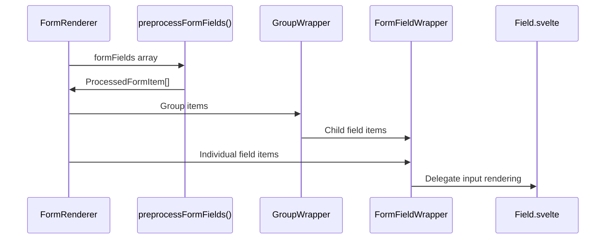

# FormRenderer Refactor Implementation Plan

## Overview

Refactor FormRenderer.svelte from complex conditional logic (135 lines) into clean, focused components following Cloudscape Design System patterns. The goal is improved maintainability and clarity without over-engineering.

## Current vs Target Architecture

### Current (Complex)
```
FormRenderer.svelte (135 lines)
├── Mixed group/field rendering logic
├── Type checking in templates (isField())
├── Nested conditionals
└── Hardcoded button rendering
```

### Target (Clean)
```
FormRenderer.svelte (40-50 lines)
├── Clean iteration over preprocessed data
└── Simple component delegation

GroupWrapper.svelte (40-50 lines)
├── Group-specific rendering & validation
└── Group metadata handling

FormFieldWrapper.svelte (60-80 lines)
├── Field labels, validation, tooltips
├── Input type switching
└── Store subscriptions
```

## Implementation Strategy

### Phase 1: Data Preprocessing
**Goal**: Move complex logic out of templates into pure functions

**Changes**:
1. Create `preprocessFormFields()` function in FormRenderer
2. Move `isField()` type checking to preprocessing
3. Prepare validation states and errors upfront

**Benefits**:
- Templates become purely declarative
- Logic is testable in isolation
- Performance improvement (less reactive computation)

### Phase 2: Extract GroupWrapper
**Goal**: Isolate group-specific rendering logic

**Component Responsibilities**:
- Group header/legend rendering
- Group tooltip display
- Group-level validation feedback
- Child field iteration

### Phase 3: Extract FormFieldWrapper  
**Goal**: Create reusable field container component

**Component Responsibilities**:
- Field label and description
- Validation error display
- Field-level styling and classes
- Input type delegation to Field.svelte

### Phase 4: Refactor FormRenderer
**Goal**: Convert to clean coordinator component

**New Structure**:
- Simple iteration over preprocessed data
- Component delegation based on item type
- No complex conditional logic

## Detailed Component Specifications

### 1. FormRenderer.svelte (Refactored)

```typescript
interface ProcessedFormItem {
    isGroup: boolean;
    uid: string;
    data: Field | Group;
    validationState?: ValidationState;
    children?: ProcessedFormItem[]; // For groups
}
```

**Key Functions**:
```typescript
function preprocessFormFields(formFields: (Field | Group)[]): ProcessedFormItem[] {
    return formFields.map(item => ({
        isGroup: 'meta' in item,
        uid: 'meta' in item ? item.meta.uid : item.uid,
        data: item,
        validationState: getValidationForItem(item),
        children: 'meta' in item ? preprocessGroupFields(item) : undefined
    }));
}
```

**Template Structure**:
```svelte
{#each preprocessedFields as item}
    {#if item.isGroup}
        <GroupWrapper {item} {uid} {functions} />
    {:else}
        <FormFieldWrapper {item} {uid} {functions} />
    {/if}
{/each}
```

### 2. GroupWrapper.svelte

**Props**:
```typescript
export let item: ProcessedFormItem;
export let uid: string;
export let functions: FormFunctions;
```

**Responsibilities**:
- Render group container with proper ARIA roles
- Display group legend/header
- Show group tooltip
- Handle group-level validation feedback
- Iterate through child fields

**Template Structure**:
```svelte
<div class="form-group" role="group" id="{groupId}">
    {#if showLabel}
        <legend>
            {item.data.meta.name}
            {#if item.data.meta.required}<em>*required</em>{/if}
        </legend>
    {/if}
    
    <div class="items">
        {#each item.children as childField}
            <FormFieldWrapper item={childField} {uid} {functions} />
        {/each}
    </div>
    
    {#if tooltip}
        <GroupTooltip {tooltip} />
    {/if}
    
    {#if groupFeedback}
        <GroupFeedback {groupFeedback} />
    {/if}
</div>
```

### 3. FormFieldWrapper.svelte

**Props**:
```typescript
export let item: ProcessedFormItem;
export let uid: string;
export let functions: FormFunctions;
export let groupId?: string; // When rendered within a group
```

**Responsibilities**:
- Field label and required indicators
- Field description/tooltip
- Validation error display
- Field container styling
- Delegate to Field.svelte for input rendering

**Template Structure**:
```svelte
<div class="form-field-wrapper {validationClasses}">
    {#if !field.hide?.label}
        <FieldLabel {field} {required} />
    {/if}
    
    {#if field.tooltip}
        <FieldDescription description={field.tooltip} />
    {/if}
    
    <!-- Delegate to existing Field.svelte -->
    <Field 
        formid={uid} 
        field={item.data} 
        group={groupId} 
        {functions} 
    />
    
    {#if validationErrors}
        <FieldValidation errors={validationErrors} />
    {/if}
</div>
```

## Data Flow



## Migration Strategy

### Step 1: Create Preprocessing
1. Add `preprocessFormFields()` function to FormRenderer
2. Test data transformation logic
3. Ensure backward compatibility

### Step 2: Extract GroupWrapper
1. Create new GroupWrapper.svelte component
2. Move group rendering logic from FormRenderer
3. Test group functionality

### Step 3: Extract FormFieldWrapper
1. Create new FormFieldWrapper.svelte component  
2. Move field container logic
3. Ensure Field.svelte integration works

### Step 4: Refactor FormRenderer
1. Replace complex conditionals with simple component delegation
2. Update template to use new components
3. Remove old conditional logic

### Step 5: Integration Testing
1. Test all field types render correctly
2. Verify group functionality
3. Check validation display
4. Ensure accessibility compliance

## Benefits

### Code Quality
- **Reduced Complexity**: FormRenderer drops from 135 to ~45 lines
- **Single Responsibility**: Each component has clear purpose
- **Testability**: Logic separated from templates

### Maintainability
- **Clear Boundaries**: Group vs field logic separated
- **Reusability**: FormFieldWrapper can be used independently
- **Debugging**: Easier to isolate issues

### Performance
- **Less Reactive Computation**: Preprocessing reduces template reactivity
- **Better Tree Shaking**: Unused logic can be eliminated
- **Cleaner Re-renders**: More granular update boundaries

## Risk Mitigation

### Backward Compatibility
- Keep existing Field.svelte interface unchanged
- FormRenderer public API remains the same
- Gradual component extraction

### Testing Strategy
- Unit tests for preprocessing functions
- Component integration tests
- Visual regression testing
- Accessibility testing

### Rollback Plan
- Maintain original FormRenderer as backup
- Feature flag new implementation
- Easy rollback if issues found

## Success Metrics

### Before Refactor
- FormRenderer: 135 lines, complex conditionals
- Mixed group/field logic
- Template-heavy validation

### After Refactor  
- FormRenderer: ~45 lines, simple delegation
- Clean separation of concerns
- Reusable components
- Improved testability

## Timeline

- **Day 1**: Data preprocessing implementation
- **Day 2**: GroupWrapper component creation
- **Day 3**: FormFieldWrapper component creation  
- **Day 4**: FormRenderer refactor and integration
- **Day 5**: Testing and refinement

This refactor provides significant architectural improvements while maintaining simplicity and avoiding over-engineering.