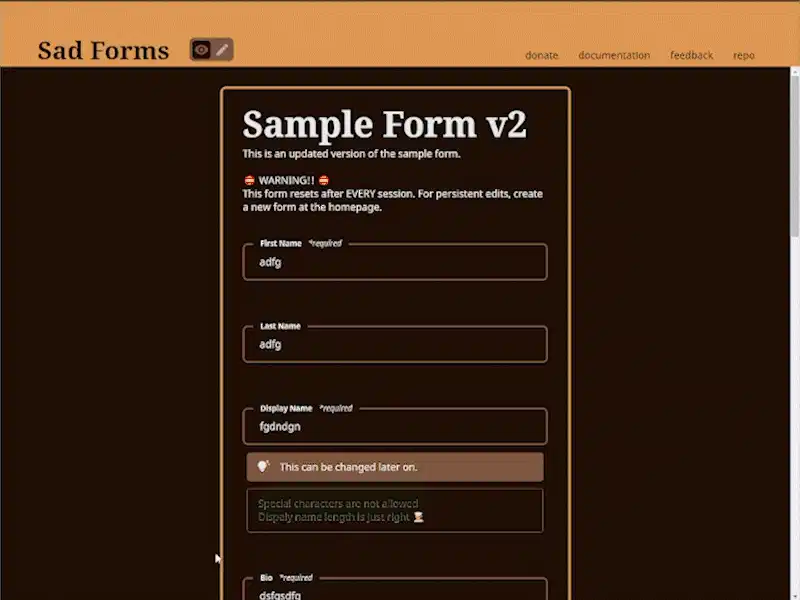

 
  

 

 

 
  
  
  <h1 align="center">
    Sad Forms
  </h1>

  <h3 align="center">
    low-level accessible forms designed for Svelte programmers
  </h3>
  

    <a href="https://sadforms.com/edit#sample%7C"><strong>Live Demo »</strong></a>
     
     
    <a href="https://sadforms.com">Website</a>
    &nbsp; • &nbsp;
    <a href="https://sadforms.com/donate">Donate</a>
    &nbsp; • &nbsp;
    <a href="https://sadforms.com/docs">Documentation</a>
    &nbsp; • &nbsp;
    <a href="https://sadforms.com/feedback">Feedback</a>
  

 

## About

Three quarter’s into first release, I discovered there already exists a plethora of Svelte form solutions. Oops. We’ll just call it reinventing the wheel or understanding/appreciating the wheel on a deeper level, whatever floats yer boat. 

Sad Forms is a byproduct of another, much larger, passion project. 

I’ve forgotten the initial solution Sad Forms was designed to solve, but accessibility is top priority! I am aware areas of the form can be improved, such as printable character navigation for dropdown/selects or live file previews, and I’m doing my best to deliver (because I also need it for my main passion project). 

See the [roadmap](https://sadforms.com/docs/roadmap) for list of upcoming features and the version logs.

(<a href="#top">back to top</a>)

 

## Feature Highlight

Sad Forms currently supports most of the popular HTML input elements while enhancing others. For a complete list of working and upcoming fields, see [Supported Fields](https://sadforms.com/docs/roadmap#Supported-Fields) section.

* ♿ a11y tested on desktop (NVDA) and mobile (TalkBack, VoiceOver)
* 🎨 easily change UI by loading in your own CSS file
* ✏ customizable dropdown with “add an option” feature
* ❓ complex form validation
* 🔏 redact inactive fields
* 📴 offline mode via localStorage

... and more!

Discover other features by exploring the documentation or tinkering with the built-in form builder, see [Sample Form](https://sadforms.com/edit#sample%7C) for an immediate example.

 

## Setup

0. Pre-requisite: SvelteKit is installed. See [SvelteKit](https://kit.svelte.dev) website for help.
1. `npm install sadforms`
2. `import Form from “sadforms”;`
3. add the `<Form />` component
4. load your custom values

still not sure how to proceed? try [https://sadforms.com/docs](https://sadforms.com/docs)

(<a href="#top">back to top</a>)

 

## Form Builder

Unless you’re somehow dynamically creating sign-up/log-in forms on the fly, feel free to utilize the online [form builder tool](https://sadforms.com) to quickly create static forms. Diagnose and view changes live in the browser.

The form builder tool is rich with debug mode and type-check-free function previewing.

See the [roadmap](https://sadforms.com/docs/roadmap) for list of upcoming features.

 

## House Keeping

* [Apache License 2.0](./LICENSE).
* [Code of Conduct](./CODE_OF_CONDUCT.md)
* [Contributing](./CONTRIBUTING.md)

 

## Contributing

Sad Forms is created and maintained by Jack Li. He is reachable through [twitter](https://twitter.com/byjackli) and email via <hello@byjackli.com>

(<a href="#top">back to top</a>)

 