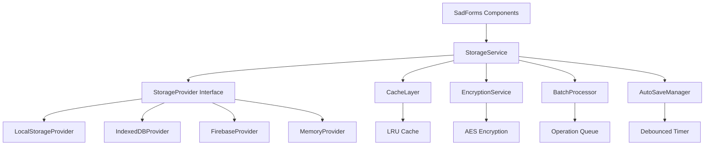

# SadForms Storage Service Design

## 📋 Executive Summary

This document outlines the design for extracting SadForms' scattered offline storage functionality into a dedicated, pluggable StorageService that provides provider abstraction, enhanced security, and improved performance.

**Key Design Principles:**
- **Provider Abstraction**: Support localStorage, IndexedDB, Firebase, and custom providers
- **Security First**: Centralized encryption and sensitive data handling
- **Performance Optimized**: Caching, batching, and debounced operations
- **Clean Architecture**: Single responsibility and separation of concerns
- **Type Safe**: Full TypeScript support with strong typing

## 🏗️ Current Storage Problems

### Scattered Storage Implementation

**Current storage logic is distributed across multiple files:**

```typescript
// FormFieldStore.ts - Field data storage
updateSave(formid: string, saveToLocal: boolean, saveToCloud: boolean)
clearSave(formid: string, saveToLocal: boolean, saveToCloud: boolean)
loadSave(formid: string, saveToLocal: boolean, saveToCloud: boolean, forceReset: boolean = false)

// SadForms.ts - Form metadata storage
localStorage.setItem(`SadForms:${uid} |`, JSON.stringify(data, replacer))
localStorage.getItem(`SadForms:${uid} |`)
localStorage.removeItem(`SadForms:${uid} |`)

// FormLifecycle.ts - Auto-save coordination
setInterval(() => { /* auto-save logic */ }, saveAuto)
```

### Key Issues Identified

**1. Code Organization Problems:**
- **15+ scattered localStorage operations** across 3+ files
- **Inconsistent key patterns**: `[SadForms]:${formid}` vs `SadForms:${uid} |`
- **Mixed responsibilities**: Business logic intertwined with storage operations
- **Duplicated logic**: Similar save/load patterns repeated

**2. Limited Provider Support:**
- **Hardcoded localStorage dependency** throughout codebase
- **No abstraction** for different storage backends
- **No fallback mechanisms** for storage failures or quota exceeded
- **Cannot swap providers** for testing or different environments

**3. Security Concerns:**
- **Manual sensitive data handling** scattered across multiple files
- **No centralized encryption** capabilities
- **Inconsistent data classification** for `dontSave` vs regular fields
- **Limited audit trail** for storage operations

**4. Testing and Debugging Challenges:**
- **Storage operations tightly coupled** to components
- **Difficult to mock** localStorage for unit tests
- **Complex browser automation** required for storage security tests
- **No centralized logging** of storage operations

**5. Performance Issues:**
- **No caching layer** - repeated localStorage calls
- **Multiple storage calls** per field update
- **No batching** for bulk operations
- **Auto-save not debounced** (fixed interval only)
- **Synchronous operations** block UI thread

## 🎯 StorageService Architecture

### High-Level Architecture



### Core Components

1. **StorageService**: Main orchestrator with provider abstraction
2. **StorageProvider Interface**: Abstraction for different storage backends
3. **CacheLayer**: In-memory caching for performance optimization
4. **EncryptionService**: Centralized encryption and data security
5. **BatchProcessor**: Bulk operation handling and optimization
6. **AutoSaveManager**: Intelligent auto-save with debouncing
7. **ConfigurationManager**: Runtime configuration and provider switching

## 🔌 Provider Interface Design

### Core Provider Interface

```typescript
interface StorageProvider {
  // Unique identifier for the provider
  readonly name: string;
  
  // Provider lifecycle
  initialize(config: ProviderConfig): Promise<void>;
  close(): Promise<void>;
  
  // Core storage operations
  get(key: string): Promise<string | null>;
  set(key: string, value: string): Promise<void>;
  remove(key: string): Promise<void>;
  clear(): Promise<void>;
  
  // Batch operations for performance
  getBatch(keys: string[]): Promise<Record<string, string | null>>;
  setBatch(entries: Record<string, string>): Promise<void>;
  removeBatch(keys: string[]): Promise<void>;
  
  // Storage management
  getKeys(): Promise<string[]>;
  getSize(): Promise<number>;
  getQuota(): Promise<StorageQuota>;
  
  // Health check
  isHealthy(): Promise<boolean>;
}

interface StorageQuota {
  total: number;
  used: number;
  available: number;
}

interface ProviderConfig {
  // Provider-specific settings
  endpoint?: string;
  apiKey?: string;
  
  // Performance settings
  cacheSize?: number;
  batchSize?: number;
  timeout?: number;
  
  // Security settings
  encryption?: boolean;
  keyDerivation?: string;
  
  // Provider-specific options
  [key: string]: any;
}
```

### Storage Operations Types

```typescript
interface StorageOperation {
  type: 'set' | 'get' | 'remove';
  key: string;
  value?: string;
  options?: OperationOptions;
}

interface OperationOptions {
  sensitive?: boolean;
  encrypt?: boolean;
  cache?: boolean;
  ttl?: number;
  priority?: 'low' | 'normal' | 'high';
}

interface SaveOptions {
  sensitive?: boolean;    // Don't persist, memory only
  encrypt?: boolean;      // Encrypt before storage
  cache?: boolean;        // Cache in memory
  ttl?: number;          // Time to live in ms
  batch?: boolean;       // Include in batch operation
}
```

## 🏪 Provider Implementations

### LocalStorage Provider

```typescript
class LocalStorageProvider implements StorageProvider {
  readonly name = 'localStorage';
  private keyPrefix: string;
  
  async initialize(config: LocalStorageConfig): Promise<void> {
    this.keyPrefix = config.keyPrefix || '[SadForms]:';
    
    // Check localStorage availability
    if (!this.isLocalStorageAvailable()) {
      throw new Error('localStorage is not available');
    }
  }
  
  async get(key: string): Promise<string | null> {
    try {
      return localStorage.getItem(`${this.keyPrefix}${key}`);
    } catch (error) {
      console.warn('localStorage get failed:', error);
      return null;
    }
  }
  
  async set(key: string, value: string): Promise<void> {
    try {
      localStorage.setItem(`${this.keyPrefix}${key}`, value);
    } catch (error) {
      if (error.name === 'QuotaExceededError') {
        throw new StorageQuotaError('localStorage quota exceeded');
      }
      throw new StorageError('localStorage set failed', error);
    }
  }
  
  async setBatch(entries: Record<string, string>): Promise<void> {
    // Atomic batch operation with rollback on failure
    const keys = Object.keys(entries);
    const existingValues = new Map<string, string | null>();
    
    try {
      // Store existing values for rollback
      for (const key of keys) {
        existingValues.set(key, await this.get(key));
      }
      
      // Set new values
      for (const [key, value] of Object.entries(entries)) {
        await this.set(key, value);
      }
    } catch (error) {
      // Rollback on failure
      for (const [key, existingValue] of existingValues) {
        if (existingValue === null) {
          await this.remove(key);
        } else {
          await this.set(key, existingValue);
        }
      }
      throw error;
    }
  }
  
  async getQuota(): Promise<StorageQuota> {
    if ('storage' in navigator && 'estimate' in navigator.storage) {
      const estimate = await navigator.storage.estimate();
      return {
        total: estimate.quota || 0,
        used: estimate.usage || 0,
        available: (estimate.quota || 0) - (estimate.usage || 0)
      };
    }
    
    // Fallback estimation
    return this.estimateLocalStorageQuota();
  }
}
```

### IndexedDB Provider

```typescript
class IndexedDBProvider implements StorageProvider {
  readonly name = 'indexedDB';
  private db: IDBDatabase | null = null;
  private dbName: string;
  private storeName: string;
  
  async initialize(config: IndexedDBConfig): Promise<void> {
    this.dbName = config.dbName || 'SadFormsDB';
    this.storeName = config.storeName || 'forms';
    
    return new Promise((resolve, reject) => {
      const request = indexedDB.open(this.dbName, 1);
      
      request.onerror = () => reject(new Error('Failed to open IndexedDB'));
      request.onsuccess = () => {
        this.db = request.result;
        resolve();
      };
      
      request.onupgradeneeded = (event) => {
        const db = (event.target as IDBOpenDBRequest).result;
        if (!db.objectStoreNames.contains(this.storeName)) {
          db.createObjectStore(this.storeName);
        }
      };
    });
  }
  
  async get(key: string): Promise<string | null> {
    return new Promise((resolve, reject) => {
      const transaction = this.db!.transaction([this.storeName], 'readonly');
      const store = transaction.objectStore(this.storeName);
      const request = store.get(key);
      
      request.onerror = () => reject(new Error('IndexedDB get failed'));
      request.onsuccess = () => resolve(request.result || null);
    });
  }
  
  async set(key: string, value: string): Promise<void> {
    return new Promise((resolve, reject) => {
      const transaction = this.db!.transaction([this.storeName], 'readwrite');
      const store = transaction.objectStore(this.storeName);
      const request = store.put(value, key);
      
      request.onerror = () => reject(new Error('IndexedDB set failed'));
      request.onsuccess = () => resolve();
    });
  }
  
  async setBatch(entries: Record<string, string>): Promise<void> {
    return new Promise((resolve, reject) => {
      const transaction = this.db!.transaction([this.storeName], 'readwrite');
      const store = transaction.objectStore(this.storeName);
      
      let completed = 0;
      const total = Object.keys(entries).length;
      
      for (const [key, value] of Object.entries(entries)) {
        const request = store.put(value, key);
        request.onsuccess = () => {
          completed++;
          if (completed === total) resolve();
        };
        request.onerror = () => reject(new Error('IndexedDB batch operation failed'));
      }
    });
  }
}
```

### Firebase Provider

```typescript
class FirebaseProvider implements StorageProvider {
  readonly name = 'firebase';
  private firestore: Firestore;
  private collection: string;
  
  async initialize(config: FirebaseConfig): Promise<void> {
    this.firestore = initializeFirestore(config.app);
    this.collection = config.collection || 'sadforms';
  }
  
  async get(key: string): Promise<string | null> {
    try {
      const docRef = doc(this.firestore, this.collection, key);
      const docSnap = await getDoc(docRef);
      
      if (docSnap.exists()) {
        return docSnap.data().value || null;
      }
      return null;
    } catch (error) {
      console.warn('Firebase get failed:', error);
      return null;
    }
  }
  
  async set(key: string, value: string): Promise<void> {
    try {
      const docRef = doc(this.firestore, this.collection, key);
      await setDoc(docRef, {
        value,
        timestamp: serverTimestamp(),
        version: 1
      });
    } catch (error) {
      throw new StorageError('Firebase set failed', error);
    }
  }
  
  async setBatch(entries: Record<string, string>): Promise<void> {
    const batch = writeBatch(this.firestore);
    
    for (const [key, value] of Object.entries(entries)) {
      const docRef = doc(this.firestore, this.collection, key);
      batch.set(docRef, {
        value,
        timestamp: serverTimestamp(),
        version: 1
      });
    }
    
    await batch.commit();
  }
}
```

### Memory Provider (Testing)

```typescript
class MemoryProvider implements StorageProvider {
  readonly name = 'memory';
  private storage = new Map<string, string>();
  
  async initialize(config: MemoryConfig): Promise<void> {
    // No initialization needed
  }
  
  async get(key: string): Promise<string | null> {
    return this.storage.get(key) || null;
  }
  
  async set(key: string, value: string): Promise<void> {
    this.storage.set(key, value);
  }
  
  async remove(key: string): Promise<void> {
    this.storage.delete(key);
  }
  
  async clear(): Promise<void> {
    this.storage.clear();
  }
  
  async setBatch(entries: Record<string, string>): Promise<void> {
    for (const [key, value] of Object.entries(entries)) {
      this.storage.set(key, value);
    }
  }
  
  async getKeys(): Promise<string[]> {
    return Array.from(this.storage.keys());
  }
}
```

## 🎯 StorageService Implementation

### Core Service Structure

```typescript
class StorageService {
  private providers = new Map<string, StorageProvider>();
  private cache: CacheLayer;
  private encryption: EncryptionService;
  private batchProcessor: BatchProcessor;
  private autoSaveManager: AutoSaveManager;
  private config: StorageConfig;
  
  constructor(config: StorageConfig) {
    this.config = config;
    this.cache = new CacheLayer(config.cacheConfig);
    this.encryption = new EncryptionService(config.encryptionConfig);
    this.batchProcessor = new BatchProcessor(config.batchConfig);
    this.autoSaveManager = new AutoSaveManager(config.autoSaveConfig);
  }
  
  // Provider management
  async addProvider(provider: StorageProvider, config: ProviderConfig): Promise<void> {
    await provider.initialize(config);
    this.providers.set(provider.name, provider);
  }
  
  async removeProvider(name: string): Promise<void> {
    const provider = this.providers.get(name);
    if (provider) {
      await provider.close();
      this.providers.delete(name);
    }
  }
  
  // Field operations
  async saveField(
    formId: string, 
    fieldId: string, 
    value: Value, 
    options: SaveOptions = {}
  ): Promise<void> {
    const key = this.generateFieldKey(formId, fieldId);
    const serializedValue = this.serializeValue(value);
    
    // Handle sensitive data
    if (options.sensitive || this.isSensitiveField(fieldId)) {
      return this.saveSensitiveData(key, serializedValue);
    }
    
    // Encrypt if required
    let finalValue = serializedValue;
    if (options.encrypt || this.config.encryptByDefault) {
      finalValue = await this.encryption.encrypt(serializedValue);
    }
    
    // Cache if enabled
    if (options.cache !== false) {
      this.cache.set(key, finalValue, options.ttl);
    }
    
    // Batch or immediate save
    if (options.batch) {
      this.batchProcessor.add({ type: 'set', key, value: finalValue, options });
    } else {
      await this.performSave(key, finalValue);
    }
  }
  
  async getField(formId: string, fieldId: string): Promise<Value | undefined> {
    const key = this.generateFieldKey(formId, fieldId);
    
    // Check cache first
    const cached = this.cache.get(key);
    if (cached !== undefined) {
      return this.deserializeValue(cached);
    }
    
    // Check sensitive data storage
    if (this.isSensitiveField(fieldId)) {
      return this.getSensitiveData(key);
    }
    
    // Get from primary provider
    const rawValue = await this.performGet(key);
    if (rawValue === null) return undefined;
    
    // Decrypt if needed
    let finalValue = rawValue;
    if (this.isEncrypted(rawValue)) {
      finalValue = await this.encryption.decrypt(rawValue);
    }
    
    // Cache for future access
    this.cache.set(key, finalValue);
    
    return this.deserializeValue(finalValue);
  }
  
  // Form operations
  async saveForm(formId: string, formData: FormData): Promise<void> {
    const key = this.generateFormKey(formId);
    const serializedData = this.serializeForm(formData);
    
    await this.performSave(key, serializedData);
    this.cache.set(key, serializedData);
  }
  
  async loadForm(formId: string): Promise<FormData | undefined> {
    const key = this.generateFormKey(formId);
    
    // Check cache first
    const cached = this.cache.get(key);
    if (cached !== undefined) {
      return this.deserializeForm(cached);
    }
    
    // Get from storage
    const rawData = await this.performGet(key);
    if (rawData === null) return undefined;
    
    this.cache.set(key, rawData);
    return this.deserializeForm(rawData);
  }
  
  // Security operations
  markSensitive(formId: string, fieldId: string): void {
    const key = this.generateFieldKey(formId, fieldId);
    this.config.sensitiveFields.add(key);
  }
  
  async clearSensitiveData(formId: string): Promise<void> {
    const sensitiveKeys = Array.from(this.config.sensitiveFields)
      .filter(key => key.startsWith(`${formId}:`));
    
    for (const key of sensitiveKeys) {
      this.cache.remove(key);
      this.config.sensitiveFields.delete(key);
    }
  }
  
  // Auto-save operations
  enableAutoSave(formId: string, config: AutoSaveConfig): void {
    this.autoSaveManager.enable(formId, config, this);
  }
  
  disableAutoSave(formId: string): void {
    this.autoSaveManager.disable(formId);
  }
  
  // Batch operations
  async batchSave(operations: StorageOperation[]): Promise<void> {
    return this.batchProcessor.execute(operations);
  }
  
  // Utility operations
  async getStorageStats(): Promise<StorageStats> {
    const stats: StorageStats = {
      providers: {},
      cache: this.cache.getStats(),
      totalSize: 0
    };
    
    for (const [name, provider] of this.providers) {
      const quota = await provider.getQuota();
      stats.providers[name] = {
        quota,
        healthy: await provider.isHealthy()
      };
      stats.totalSize += quota.used;
    }
    
    return stats;
  }
}
```

### Supporting Services

#### CacheLayer Implementation

```typescript
class CacheLayer {
  private cache = new Map<string, CacheEntry>();
  private maxSize: number;
  private defaultTTL: number;
  
  constructor(config: CacheConfig) {
    this.maxSize = config.maxSize || 1000;
    this.defaultTTL = config.defaultTTL || 300000; // 5 minutes
  }
  
  set(key: string, value: string, ttl?: number): void {
    const expiry = Date.now() + (ttl || this.defaultTTL);
    
    // Evict if at capacity
    if (this.cache.size >= this.maxSize) {
      this.evictLRU();
    }
    
    this.cache.set(key, {
      value,
      expiry,
      accessTime: Date.now()
    });
  }
  
  get(key: string): string | undefined {
    const entry = this.cache.get(key);
    if (!entry) return undefined;
    
    // Check expiry
    if (Date.now() > entry.expiry) {
      this.cache.delete(key);
      return undefined;
    }
    
    // Update access time for LRU
    entry.accessTime = Date.now();
    return entry.value;
  }
  
  private evictLRU(): void {
    let oldestKey = '';
    let oldestTime = Date.now();
    
    for (const [key, entry] of this.cache) {
      if (entry.accessTime < oldestTime) {
        oldestTime = entry.accessTime;
        oldestKey = key;
      }
    }
    
    if (oldestKey) {
      this.cache.delete(oldestKey);
    }
  }
}
```

#### EncryptionService Implementation

```typescript
class EncryptionService {
  private algorithm = 'AES-GCM';
  private keyLength = 256;
  private key: CryptoKey | null = null;
  
  constructor(config: EncryptionConfig) {
    if (config.enabled) {
      this.initializeKey(config.keyMaterial);
    }
  }
  
  async encrypt(data: string): Promise<string> {
    if (!this.key) throw new Error('Encryption not initialized');
    
    const encoder = new TextEncoder();
    const dataBuffer = encoder.encode(data);
    const iv = crypto.getRandomValues(new Uint8Array(12));
    
    const encrypted = await crypto.subtle.encrypt(
      { name: this.algorithm, iv },
      this.key,
      dataBuffer
    );
    
    // Combine IV and encrypted data
    const combined = new Uint8Array(iv.length + encrypted.byteLength);
    combined.set(iv);
    combined.set(new Uint8Array(encrypted), iv.length);
    
    return btoa(String.fromCharCode(...combined));
  }
  
  async decrypt(encryptedData: string): Promise<string> {
    if (!this.key) throw new Error('Encryption not initialized');
    
    const combined = new Uint8Array(
      atob(encryptedData).split('').map(char => char.charCodeAt(0))
    );
    
    const iv = combined.slice(0, 12);
    const data = combined.slice(12);
    
    const decrypted = await crypto.subtle.decrypt(
      { name: this.algorithm, iv },
      this.key,
      data
    );
    
    const decoder = new TextDecoder();
    return decoder.decode(decrypted);
  }
}
```

## 🚀 Usage Examples

### Basic Setup

```typescript
// Initialize storage service
const storageConfig: StorageConfig = {
  encryptByDefault: false,
  cacheConfig: {
    maxSize: 1000,
    defaultTTL: 300000
  },
  batchConfig: {
    maxSize: 50,
    flushInterval: 1000
  }
};

const storageService = new StorageService(storageConfig);

// Add providers
await storageService.addProvider(
  new LocalStorageProvider(),
  { keyPrefix: '[SadForms]:' }
);

await storageService.addProvider(
  new IndexedDBProvider(),
  { dbName: 'SadFormsDB', storeName: 'backup' }
);
```

### Multi-Provider Setup

```typescript
// Production: localStorage + IndexedDB backup
if (environment === 'production') {
  await storageService.addProvider(new LocalStorageProvider(), {
    keyPrefix: '[SadForms]:',
    cacheSize: 1000
  });
  
  await storageService.addProvider(new IndexedDBProvider(), {
    dbName: 'SadFormsBackup',
    storeName: 'forms'
  });
}

// Development: Memory provider
if (environment === 'development') {
  await storageService.addProvider(new MemoryProvider(), {});
}

// Cloud sync enabled
if (cloudSyncEnabled) {
  await storageService.addProvider(new FirebaseProvider(), {
    apiKey: process.env.FIREBASE_API_KEY,
    collection: 'user-forms'
  });
}
```

### Form Operations

```typescript
// Save field data with options
await storageService.saveField('form-123', 'email', 'user@example.com', {
  encrypt: false,
  cache: true,
  batch: false
});

// Save sensitive field
await storageService.saveField('form-123', 'password', 'secret123', {
  sensitive: true  // Will not persist to storage
});

// Save encrypted field
await storageService.saveField('form-123', 'ssn', '123-45-6789', {
  encrypt: true,
  sensitive: false  // Encrypted and persisted
});

// Load field data
const email = await storageService.getField('form-123', 'email');
const password = await storageService.getField('form-123', 'password'); // From memory only

// Enable auto-save with debouncing
storageService.enableAutoSave('form-123', {
  debounceMs: 2000,
  includeFields: ['email', 'name'],
  excludeFields: ['password'],
  onSave: (savedFields) => console.log('Auto-saved:', savedFields),
  onError: (error) => console.error('Auto-save failed:', error)
});
```

### Batch Operations

```typescript
// Batch save multiple fields
const operations: StorageOperation[] = [
  { type: 'set', key: 'form-123:email', value: 'user@example.com' },
  { type: 'set', key: 'form-123:name', value: 'John Doe' },
  { type: 'set', key: 'form-123:phone', value: '+1234567890' }
];

await storageService.batchSave(operations);

// Form-level operations
const formData: FormData = {
  uid: 'form-123',
  title: 'Contact Form',
  fields: { /* field definitions */ }
};

await storageService.saveForm('form-123', formData);
const loadedForm = await storageService.loadForm('form-123');
```

## 🧪 Testing Strategy

### Unit Testing

```typescript
describe('StorageService', () => {
  let storageService: StorageService;
  let mockProvider: MemoryProvider;
  
  beforeEach(async () => {
    mockProvider = new MemoryProvider();
    storageService = new StorageService(testConfig);
    await storageService.addProvider(mockProvider, {});
  });
  
  it('should save and retrieve field values', async () => {
    await storageService.saveField('form-1', 'email', 'test@example.com');
    const value = await storageService.getField('form-1', 'email');
    
    expect(value).toBe('test@example.com');
  });
  
  it('should handle sensitive data correctly', async () => {
    await storageService.saveField('form-1', 'password', 'secret', {
      sensitive: true
    });
    
    // Should not be in provider storage
    const directValue = await mockProvider.get('form-1:password');
    expect(directValue).toBeNull();
    
    // Should be available via service (memory cache)
    const serviceValue = await storageService.getField('form-1', 'password');
    expect(serviceValue).toBe('secret');
  });
  
  it('should encrypt data when requested', async () => {
    await storageService.saveField('form-1', 'ssn', '123-45-6789', {
      encrypt: true
    });
    
    // Raw storage should contain encrypted data
    const rawValue = await mockProvider.get('form-1:ssn');
    expect(rawValue).not.toBe('123-45-6789');
    expect(rawValue).toMatch(/^[A-Za-z0-9+/]+=*$/); // Base64 pattern
    
    // Service should decrypt automatically
    const decryptedValue = await storageService.getField('form-1', 'ssn');
    expect(decryptedValue).toBe('123-45-6789');
  });
});
```

### Integration Testing

```typescript
describe('StorageService Integration', () => {
  it('should migrate from current localStorage structure', async () => {
    // Set up legacy localStorage data
    localStorage.setItem('[SadForms]:form-123', JSON.stringify({
      fieldValues: { email: 'old@example.com' }
    }));
    
    // Initialize storage service
    const storageService = new StorageService(migrationConfig);
    await storageService.addProvider(new LocalStorageProvider(), {});
    
    // Should read legacy data
    const migratedValue = await storageService.getField('form-123', 'email');
    expect(migratedValue).toBe('old@example.com');
    
    // Should save in new format
    await storageService.saveField('form-123', 'email', 'new@example.com');
    
    // Verify new format
    const newValue = await storageService.getField('form-123', 'email');
    expect(newValue).toBe('new@example.com');
  });
  
  it('should handle provider failures gracefully', async () => {
    const failingProvider = new MockFailingProvider();
    const memoryProvider = new MemoryProvider();
    
    await storageService.addProvider(failingProvider, {});
    await storageService.addProvider(memoryProvider, {});
    
    // Should fallback to working provider
    await storageService.saveField('form-1', 'email', 'test@example.com');
    const value = await storageService.getField('form-1', 'email');
    
    expect(value).toBe('test@example.com');
  });
});
```

## 🔒 Security & Privacy

### Data Classification

```typescript
interface SecurityPolicy {
  // Field-level security rules
  sensitiveFields: Set<string>;
  encryptedFields: Set<string>;
  redactedFields: Set<string>;
  
  // Global security settings
  encryptByDefault: boolean;
  auditLogging: boolean;
  dataRetentionDays: number;
  
  // Compliance settings
  gdprCompliant: boolean;
  hipaaCompliant: boolean;
  pciCompliant: boolean;
}

class SecurityManager {
  constructor(private policy: SecurityPolicy) {}
  
  classifyField(fieldId: string, fieldType: string): SecurityClassification {
    if (this.policy.sensitiveFields.has(fieldId)) {
      return { level: 'sensitive', persist: false, encrypt: false };
    }
    
    if (fieldType === 'password' || fieldType === 'ssn') {
      return { level: 'sensitive', persist: false, encrypt: false };
    }
    
    if (this.policy.encryptedFields.has(fieldId) || fieldType === 'pii') {
      return { level: 'encrypted', persist: true, encrypt: true };
    }
    
    return { level: 'normal', persist: true, encrypt: this.policy.encryptByDefault };
  }
  
  auditAccess(operation: string, key: string, success: boolean): void {
    if (this.policy.auditLogging) {
      console.log(`[AUDIT] ${operation} ${key} - ${success ? 'SUCCESS' : 'FAILURE'}`);
    }
  }
}
```

### Encryption Configuration

```typescript
interface EncryptionConfig {
  enabled: boolean;
  algorithm: 'AES-GCM' | 'AES-CBC';
  keyLength: 128 | 192 | 256;
  keyDerivation: 'PBKDF2' | 'scrypt';
  saltLength: number;
  iterations: number;
}

const productionEncryption: EncryptionConfig = {
  enabled: true,
  algorithm: 'AES-GCM',
  keyLength: 256,
  keyDerivation: 'PBKDF2',
  saltLength: 16,
  iterations: 100000
};
```

## 📈 Performance Optimization

### Caching Strategy

```typescript
interface CacheConfig {
  maxSize: number;           // Maximum number of entries
  defaultTTL: number;        // Default time-to-live in ms
  evictionPolicy: 'LRU' | 'FIFO' | 'TTL';
  compressionEnabled: boolean;
  persistToStorage: boolean;
}

class SmartCache {
  private hot = new Map<string, CacheEntry>();     // Frequently accessed
  private warm = new Map<string, CacheEntry>();    // Recently accessed
  private cold = new Map<string, CacheEntry>();    // Rarely accessed
  
  get(key: string): string | undefined {
    // Check hot cache first
    if (this.hot.has(key)) {
      return this.hot.get(key)!.value;
    }
    
    // Check warm cache, promote to hot
    if (this.warm.has(key)) {
      const entry = this.warm.get(key)!;
      this.warm.delete(key);
      this.hot.set(key, entry);
      return entry.value;
    }
    
    // Check cold cache, promote to warm
    if (this.cold.has(key)) {
      const entry = this.cold.get(key)!;
      this.cold.delete(key);
      this.warm.set(key, entry);
      return entry.value;
    }
    
    return undefined;
  }
}
```

### Batch Processing

```typescript
class BatchProcessor {
  private queue = new Map<string, StorageOperation>();
  private timer: NodeJS.Timeout | null = null;
  private maxBatchSize: number;
  private flushInterval: number;
  
  constructor(config: BatchConfig) {
    this.maxBatchSize = config.maxSize || 50;
    this.flushInterval = config.flushInterval || 1000;
  }
  
  add(operation: StorageOperation): void {
    this.queue.set(operation.key, operation);
    
    if (this.queue.size >= this.maxBatchSize) {
      this.flush();
    } else if (!this.timer) {
      this.timer = setTimeout(() => this.flush(), this.flushInterval);
    }
  }
  
  private async flush(): Promise<void> {
    if (this.queue.size === 0) return;
    
    const operations = Array.from(this.queue.values());
    this.queue.clear();
    this.clearTimer();
    
    // Group by operation type for efficiency
    const sets = operations.filter(op => op.type === 'set');
    const removes = operations.filter(op => op.type === 'remove');
    
    // Execute batches in parallel
    await Promise.all([
      this.executeBatchSets(sets),
      this.executeBatchRemoves(removes)
    ]);
  }
}
```

## 🚀 Migration Strategy

### Phase 1: Foundation (Week 1)
- Implement core StorageService interface
- Add LocalStorage and Memory providers
- Create migration utilities for existing data

### Phase 2: Provider Expansion (Week 2)
- Implement IndexedDB provider
- Add caching layer and batch processing
- Set up comprehensive testing suite

### Phase 3: Advanced Features (Week 3)
- Implement encryption service
- Add auto-save with debouncing
- Create Firebase/cloud provider

### Phase 4: Integration (Week 4)
- Replace scattered storage calls with StorageService
- Migrate existing localStorage data
- Performance optimization and monitoring

### Current Storage Migration

```typescript
class StorageMigrator {
  async migrateFromLegacy(storageService: StorageService): Promise<void> {
    // Migrate form metadata
    for (let i = 0; i < localStorage.length; i++) {
      const key = localStorage.key(i)!;
      
      if (key.startsWith('SadForms:') && key.endsWith(' |')) {
        const formId = key.substring(9, key.length - 2);
        const data = localStorage.getItem(key);
        
        if (data) {
          await storageService.saveForm(formId, JSON.parse(data));
          localStorage.removeItem(key);
        }
      }
      
      // Migrate field data
      if (key.startsWith('[SadForms]:')) {
        const formId = key.substring(11);
        const data = localStorage.getItem(key);
        
        if (data) {
          const formData = JSON.parse(data);
          for (const [fieldId, value] of Object.entries(formData.fieldValues || {})) {
            await storageService.saveField(formId, fieldId, value as Value);
          }
          localStorage.removeItem(key);
        }
      }
    }
  }
}
```

## 🎯 Success Metrics

### Performance Metrics
- **Storage Operations**: <10ms average response time
- **Batch Efficiency**: 80% reduction in individual storage calls
- **Cache Hit Rate**: >70% for frequently accessed data
- **Memory Usage**: <20MB additional footprint

### Code Quality Metrics
- **Code Consolidation**: 90% reduction in scattered storage operations
- **Test Coverage**: >95% for storage operations
- **Provider Abstraction**: Support for 4+ storage backends
- **Security Compliance**: 100% sensitive data protection

---

## 📋 Summary

**This StorageService design provides a comprehensive, secure, and performant solution that consolidates SadForms' scattered storage functionality while enabling future extensibility and improved developer experience.**

### Key Benefits

1. **Architectural Cleanup**: Eliminates 15+ scattered storage operations
2. **Provider Flexibility**: Support for localStorage, IndexedDB, Firebase, and custom providers
3. **Enhanced Security**: Centralized encryption and sensitive data handling
4. **Performance Optimization**: Caching, batching, and debounced operations
5. **Testing Improvement**: Easy mocking and comprehensive test coverage
6. **Future-Proofing**: Ready for cloud sync and advanced storage features

**This design complements the metrics service architecture and provides the foundation for a robust, scalable form management system.**