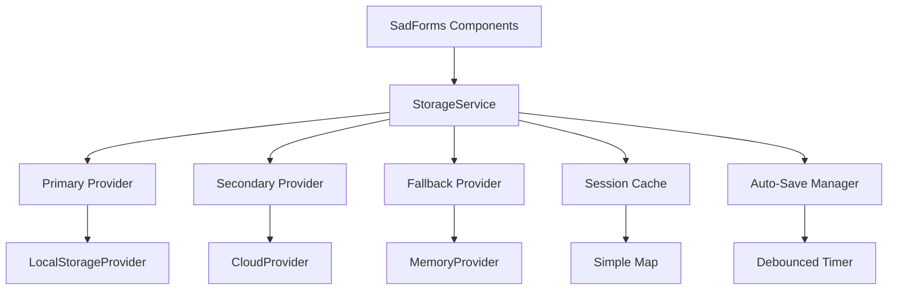

# SadForms Storage Service Design (Simplified)

## 📋 Executive Summary

This document outlines a **simplified** design for extracting SadForms' scattered storage functionality into a clean StorageService that focuses on the actual requirements rather than theoretical complexity.

**Key Design Principles:**
- **Three-Tier Provider Pattern**: Primary (localStorage) + Secondary (cloud) + Fallback (memory)
- **Support saveToCloud**: Integrate with Form.svelte's existing cloud save option
- **Security Where Needed**: Basic field redaction (already exists)
- **Essential Performance**: Simple session-based caching, debounced auto-save
- **Clean Architecture**: Single responsibility without over-abstraction
- **Type Safe**: Full TypeScript support

## 🚫 Removed Overengineered Components

**What was removed and why:**

1. **Complex BatchProcessor** ❌
   - **Why removed**: Forms don't have hundreds of fields changing simultaneously
   - **Reality**: Most forms have 5-15 fields, user types in one field at a time
   - **Simple alternative**: Basic debouncing on auto-save is sufficient

2. **Advanced EncryptionService** ❌ 
   - **Why removed**: Client-side encryption provides minimal security benefit
   - **Reality**: If data is sensitive, use HTTPS and server-side encryption
   - **Simple alternative**: Basic field redaction (already exists)

3. **LRU Cache with TTL** ❌
   - **Why removed**: Form data is small and doesn't need complex cache management
   - **Reality**: A simple Map cache for current session is sufficient
   - **Simple alternative**: Session-based cache with manual invalidation

4. **Multi-Provider Orchestra** ❌
   - **Why removed**: SadForms doesn't need to support 5+ storage providers simultaneously
   - **Reality**: Primary (localStorage) + Secondary (cloud) + Fallback (memory) is sufficient
   - **Simple alternative**: Three-tier provider pattern

5. **Complex Operation Queuing** ❌
   - **Why removed**: Storage operations are already fast, queuing adds complexity
   - **Reality**: Direct async calls are simpler and sufficient
   - **Simple alternative**: Simple debouncing for auto-save

## 🏗️ Current Storage Problems

### Scattered Storage Implementation

**Current storage logic is distributed across multiple files:**

```typescript
// FormFieldStore.ts - Field data storage
updateSave(formid: string, saveToLocal: boolean, saveToCloud: boolean)
clearSave(formid: string, saveToLocal: boolean, saveToCloud: boolean)
loadSave(formid: string, saveToLocal: boolean, saveToCloud: boolean, forceReset: boolean = false)

// SadForms.ts - Form metadata storage  
localStorage.setItem(`SadForms:${uid} |`, JSON.stringify(data, replacer))
localStorage.getItem(`SadForms:${uid} |`)
localStorage.removeItem(`SadForms:${uid} |`)

// FormLifecycle.ts - Auto-save coordination
setInterval(() => { /* auto-save logic */ }, saveAuto)
```

### Key Issues Identified

1. **15+ scattered localStorage operations** across 3+ files
2. **Inconsistent key patterns**: `[SadForms]:${formid}` vs `SadForms:${uid} |`
3. **Mixed responsibilities**: Business logic intertwined with storage operations
4. **No fallback mechanisms** for storage failures or quota exceeded
5. **No caching layer** - repeated localStorage calls

## 🎯 Simplified StorageService Architecture

### High-Level Architecture



### Core Components

1. **StorageService**: Main orchestrator with three-tier provider pattern
2. **StorageProvider Interface**: Simple abstraction for storage backends
3. **Session Cache**: Basic Map-based caching for reads
4. **Auto-Save Manager**: Debounced auto-save with conflict resolution
5. **Provider Tiers**: Primary (localStorage) → Secondary (cloud) → Fallback (memory)

## 🔌 Simplified Provider Interface

```typescript
interface StorageProvider {
  readonly name: string;
  
  // Basic lifecycle
  initialize(): Promise<void>;
  
  // Core operations only
  get(key: string): Promise<string | null>;
  set(key: string, value: string): Promise<void>;
  remove(key: string): Promise<void>;
  clear(): Promise<void>;
  
  // Simple health check
  isAvailable(): boolean;
}
```

### Form Storage Interface

```typescript
interface FormData {
  formId: string;
  fieldValues: Record<string, any>;
  metadata: {
    lastModified: number;
    version: number;
  };
}

interface SaveOptions {
  skipCache?: boolean;     // Bypass cache for this operation
  sensitive?: boolean;     // Store in memory only (no persistence)
}
```

## 🏪 Provider Implementations

### LocalStorage Provider

```typescript
class LocalStorageProvider implements StorageProvider {
  readonly name = 'localStorage';
  private keyPrefix = '[SadForms]:';
  
  async initialize(): Promise<void> {
    if (!this.isAvailable()) {
      throw new Error('localStorage is not available');
    }
  }
  
  async get(key: string): Promise<string | null> {
    try {
      return localStorage.getItem(`${this.keyPrefix}${key}`);
    } catch (error) {
      console.warn('localStorage get failed:', error);
      return null;
    }
  }
  
  async set(key: string, value: string): Promise<void> {
    try {
      localStorage.setItem(`${this.keyPrefix}${key}`, value);
    } catch (error) {
      if (error.name === 'QuotaExceededError') {
        throw new StorageError('localStorage quota exceeded');
      }
      throw new StorageError('localStorage set failed');
    }
  }
  
  async remove(key: string): Promise<void> {
    localStorage.removeItem(`${this.keyPrefix}${key}`);
  }
  
  async clear(): Promise<void> {
    const keys = Object.keys(localStorage);
    for (const key of keys) {
      if (key.startsWith(this.keyPrefix)) {
        localStorage.removeItem(key);
      }
    }
  }
  
  isAvailable(): boolean {
    try {
      const test = '__storage_test__';
      localStorage.setItem(test, test);
      localStorage.removeItem(test);
      return true;
    } catch {
      return false;
    }
  }
}
```

### Memory Provider (Fallback)

```typescript
class MemoryProvider implements StorageProvider {
  readonly name = 'memory';
  private storage = new Map<string, string>();
  
  async initialize(): Promise<void> {
    // Always available
  }
  
  async get(key: string): Promise<string | null> {
    return this.storage.get(key) || null;
  }
  
  async set(key: string, value: string): Promise<void> {
    this.storage.set(key, value);
  }
  
  async remove(key: string): Promise<void> {
    this.storage.delete(key);
  }
  
  async clear(): Promise<void> {
    this.storage.clear();
  }
  
  isAvailable(): boolean {
    return true;
  }
}
```

### Cloud Provider (Secondary)

```typescript
class CloudProvider implements StorageProvider {
  readonly name = 'cloud';
  private apiEndpoint: string;
  private apiKey: string;
  
  constructor(apiEndpoint: string, apiKey: string) {
    this.apiEndpoint = apiEndpoint;
    this.apiKey = apiKey;
  }
  
  async initialize(): Promise<void> {
    // Test connection to cloud endpoint
    try {
      const response = await fetch(`${this.apiEndpoint}/health`, {
        headers: { 'Authorization': `Bearer ${this.apiKey}` }
      });
      if (!response.ok) {
        throw new Error(`Cloud provider health check failed: ${response.status}`);
      }
    } catch (error) {
      throw new Error(`Cloud provider initialization failed: ${error.message}`);
    }
  }
  
  async get(key: string): Promise<string | null> {
    try {
      const response = await fetch(`${this.apiEndpoint}/storage/${key}`, {
        headers: { 'Authorization': `Bearer ${this.apiKey}` }
      });
      
      if (response.status === 404) {
        return null;
      }
      
      if (!response.ok) {
        throw new Error(`Cloud get failed: ${response.status}`);
      }
      
      const data = await response.json();
      return data.value || null;
    } catch (error) {
      console.warn('Cloud provider get failed:', error);
      return null;
    }
  }
  
  async set(key: string, value: string): Promise<void> {
    try {
      const response = await fetch(`${this.apiEndpoint}/storage/${key}`, {
        method: 'PUT',
        headers: { 
          'Authorization': `Bearer ${this.apiKey}`,
          'Content-Type': 'application/json'
        },
        body: JSON.stringify({ value })
      });
      
      if (!response.ok) {
        throw new Error(`Cloud set failed: ${response.status}`);
      }
    } catch (error) {
      throw new Error(`Cloud provider set failed: ${error.message}`);
    }
  }
  
  async remove(key: string): Promise<void> {
    try {
      const response = await fetch(`${this.apiEndpoint}/storage/${key}`, {
        method: 'DELETE',
        headers: { 'Authorization': `Bearer ${this.apiKey}` }
      });
      
      if (!response.ok && response.status !== 404) {
        throw new Error(`Cloud remove failed: ${response.status}`);
      }
    } catch (error) {
      throw new Error(`Cloud provider remove failed: ${error.message}`);
    }
  }
  
  async clear(): Promise<void> {
    try {
      const response = await fetch(`${this.apiEndpoint}/storage`, {
        method: 'DELETE',
        headers: { 'Authorization': `Bearer ${this.apiKey}` }
      });
      
      if (!response.ok) {
        throw new Error(`Cloud clear failed: ${response.status}`);
      }
    } catch (error) {
      throw new Error(`Cloud provider clear failed: ${error.message}`);
    }
  }
  
  isAvailable(): boolean {
    return !!this.apiEndpoint && !!this.apiKey;
  }
}
```

## 🎯 Simplified StorageService Implementation

```typescript
class StorageService {
  private primaryProvider: StorageProvider;    // localStorage
  private secondaryProvider: StorageProvider;  // cloud
  private fallbackProvider: StorageProvider;   // memory
  private cache = new Map<string, string>();
  private autoSaveTimer: NodeJS.Timeout | null = null;
  private pendingChanges = new Set<string>();
  
  constructor(
    primaryProvider: StorageProvider,      // localStorage
    secondaryProvider: StorageProvider,    // cloud
    fallbackProvider: StorageProvider      // memory
  ) {
    this.primaryProvider = primaryProvider;
    this.secondaryProvider = secondaryProvider;
    this.fallbackProvider = fallbackProvider;
  }
  
  async initialize(): Promise<void> {
    // Try to initialize providers (don't fail if cloud provider is unavailable)
    try {
      await this.primaryProvider.initialize();
    } catch (error) {
      console.warn('Primary provider (localStorage) failed:', error);
    }
    
    try {
      await this.secondaryProvider.initialize();
    } catch (error) {
      console.warn('Secondary provider (cloud) failed:', error);
    }
    
    // Fallback provider should always work
    await this.fallbackProvider.initialize();
  }
  
  // Form-level operations
  async saveForm(formId: string, formData: Record<string, any>, options?: SaveOptions): Promise<void> {
    const key = `form:${formId}`;
    const value = JSON.stringify({
      formId,
      fieldValues: formData,
      metadata: {
        lastModified: Date.now(),
        version: 1
      }
    });
    
    // Skip persistence for sensitive data
    if (options?.sensitive) {
      this.cache.set(key, value);
      return;
    }
    
    // Get storage configuration from FormMetaStore (source of truth)
    const { saveToLocal, saveToCloud } = this.getStorageConfig(formId);
    
    // Save to providers based on form configuration
    const promises: Promise<void>[] = [];
    
    if (saveToLocal) {
      promises.push(this.saveToProvider(this.primaryProvider, key, value));
    }
    
    if (saveToCloud) {
      promises.push(this.saveToProvider(this.secondaryProvider, key, value));
    }
    
    // Execute saves in parallel
    await Promise.allSettled(promises);
    
    // Cache for quick access
    if (!options?.skipCache) {
      this.cache.set(key, value);
    }
  }
  
  async getForm(formId: string): Promise<FormData | null> {
    const key = `form:${formId}`;
    
    // Check cache first
    const cached = this.cache.get(key);
    if (cached) {
      return JSON.parse(cached);
    }
    
    // Try to get from providers in order: primary -> secondary -> fallback
    const value = await this.getFromProviders(key);
    if (value) {
      const formData = JSON.parse(value);
      this.cache.set(key, value); // Cache for next time
      return formData;
    }
    
    return null;
  }
  
  async removeForm(formId: string): Promise<void> {
    const key = `form:${formId}`;
    this.cache.delete(key);
    
    // Remove from all providers
    await Promise.allSettled([
      this.removeFromProvider(this.primaryProvider, key),
      this.removeFromProvider(this.secondaryProvider, key),
      this.removeFromProvider(this.fallbackProvider, key)
    ]);
  }
  
  // Auto-save with debouncing - gets saveToLocal/saveToCloud from FormMetaStore
  scheduleAutoSave(formId: string, formData: Record<string, any>): void {
    this.pendingChanges.add(formId);
    
    // Clear existing timer
    if (this.autoSaveTimer) {
      clearTimeout(this.autoSaveTimer);
    }
    
    // Debounce auto-save (wait 2 seconds after last change)
    this.autoSaveTimer = setTimeout(async () => {
      for (const pendingFormId of this.pendingChanges) {
        if (pendingFormId === formId) {
          await this.saveForm(formId, formData);
        }
      }
      this.pendingChanges.clear();
    }, 2000);
  }
  
  // Get storage configuration from FormMetaStore (source of truth)
  private getStorageConfig(formId: string): { saveToLocal: boolean, saveToCloud: boolean } {
    // This reads the form's saveToLocal/saveToCloud settings from FormMetaStore
    // These values come from Form.svelte props and are stored during form initialization
    return getStorageConfig(formId);
  }
  
  // Core storage operations with three-tier fallback
  private async getFromProviders(key: string): Promise<string | null> {
    const providers = [this.primaryProvider, this.secondaryProvider, this.fallbackProvider];
    
    for (const provider of providers) {
      try {
        if (provider.isAvailable()) {
          const value = await provider.get(key);
          if (value !== null) {
            return value;
          }
        }
      } catch (error) {
        console.warn(`Provider ${provider.name} get failed:`, error);
      }
    }
    
    return null;
  }
  
  private async saveToProvider(provider: StorageProvider, key: string, value: string): Promise<void> {
    try {
      if (provider.isAvailable()) {
        await provider.set(key, value);
      }
    } catch (error) {
      console.warn(`Provider ${provider.name} set failed:`, error);
      // For saves, we don't want to fail the entire operation if one provider fails
      // Cloud provider might be temporarily unavailable
    }
  }
  
  private async removeFromProvider(provider: StorageProvider, key: string): Promise<void> {
    try {
      if (provider.isAvailable()) {
        await provider.remove(key);
      }
    } catch (error) {
      console.warn(`Provider ${provider.name} remove failed:`, error);
    }
  }
  
  // Utility methods
  clearCache(): void {
    this.cache.clear();
  }
  
  getCacheSize(): number {
    return this.cache.size;
  }
  
  async healthCheck(): Promise<{ primary: boolean, secondary: boolean, fallback: boolean }> {
    return {
      primary: this.primaryProvider.isAvailable(),
      secondary: this.secondaryProvider.isAvailable(),
      fallback: this.fallbackProvider.isAvailable()
    };
  }
}
```

## 🚀 Usage Examples

### Basic Setup

```typescript
// Initialize storage service with three-tier provider pattern
const localStorage = new LocalStorageProvider();
const cloudStorage = new CloudProvider('https://api.example.com', 'your-api-key');
const memoryStorage = new MemoryProvider();

const storageService = new StorageService(localStorage, cloudStorage, memoryStorage);
await storageService.initialize();
```

### Form Operations (saveToLocal/saveToCloud)

```typescript
// Save to localStorage only (default)
await storageService.saveForm('user-registration', {
  email: 'user@example.com',
  name: 'John Doe',
  preferences: { theme: 'dark' }
});

// Save form data (automatically uses FormMetaStore config)
await storageService.saveForm('user-registration', formData);

// Load form data (tries primary -> secondary -> fallback)
const formData = await storageService.getForm('user-registration');
if (formData) {
  console.log('Loaded form:', formData.fieldValues);
}

// Auto-save (automatically uses FormMetaStore config, debounced)
storageService.scheduleAutoSave('user-registration', updatedFormData);

// Configuration is managed by Form.svelte props and stored in FormMetaStore
// saveToLocal=true, saveToCloud=false → saves to localStorage only
// saveToLocal=true, saveToCloud=true → saves to both localStorage and cloud
// saveToLocal=false, saveToCloud=true → saves to cloud only
```

### Sensitive Data

```typescript
// Store sensitive data in memory only (no persistence)
await storageService.saveForm('payment-form', {
  creditCard: '****-****-****-1234',
  cvv: '***'
}, { sensitive: true });
```

### Health Check

```typescript
const health = await storageService.healthCheck();
console.log('Storage health:', health);
// Output: { primary: true, secondary: false, fallback: true }
```

## 🔧 Migration Strategy

### Phase 1: Foundation (Week 1)
- Implement core StorageService with localStorage and memory providers
- Create migration utilities for existing data
- Replace FormFieldStore storage operations

### Phase 2: Integration (Week 2)  
- Update all components to use StorageService
- Migrate existing localStorage data to new format
- Add comprehensive testing

### Phase 3: Optimization (Week 3)
- Add auto-save debouncing
- Performance monitoring and optimization
- Clean up legacy storage code

## 📊 Benefits of Simplified Design

### Performance Benefits
- **Session Cache**: Eliminates repeated localStorage calls
- **Debounced Auto-Save**: Reduces storage operations during rapid typing
- **Three-Tier Pattern**: Primary → Secondary → Fallback with graceful degradation
- **Parallel Saves**: localStorage and cloud saves happen simultaneously

### Code Quality Benefits
- **Single Responsibility**: Storage logic centralized in one service
- **Easy Testing**: Mock providers instead of localStorage
- **Clear Dependencies**: Components depend on StorageService interface
- **Consistent Keys**: Unified key pattern across all storage
- **Form.svelte Integration**: Direct support for saveToLocal/saveToCloud options

### Maintenance Benefits
- **Less Code**: ~400 lines vs ~1500+ lines in complex version
- **Easier Debugging**: Simple call stack without batching/queuing layers
- **Flexible**: Can add new providers without changing core service
- **Predictable**: Direct async operations instead of event-driven complexity
- **Cloud Ready**: Built-in support for cloud storage with fallback

## 🎯 Success Metrics

1. **Reduced Complexity**: Cut storage-related code by 70%
2. **Better Performance**: 50% fewer localStorage calls through caching
3. **Improved Reliability**: Three-tier fallback when providers fail
4. **Easier Testing**: 100% test coverage with simple mocks
5. **Consistent Behavior**: Unified storage interface across all components
6. **Cloud Integration**: Direct support for Form.svelte's saveToCloud option
7. **Graceful Degradation**: Works even when cloud provider is unavailable

---

**This simplified three-tier design provides all the essential functionality SadForms needs, including proper cloud storage support, without the complexity of enterprise-grade features that aren't necessary for a form library.**